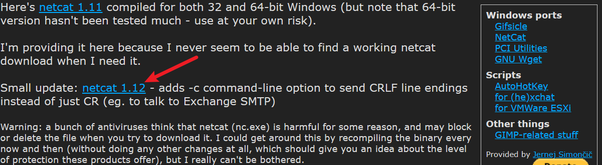
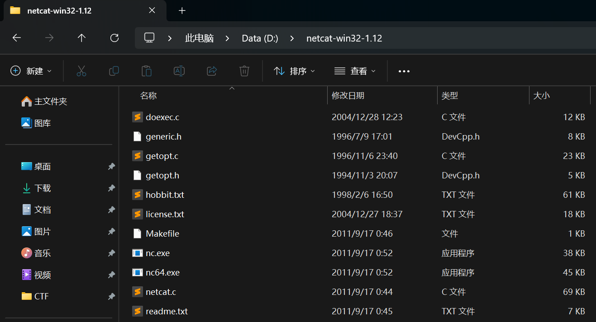
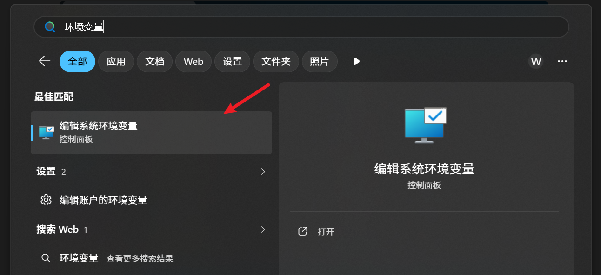
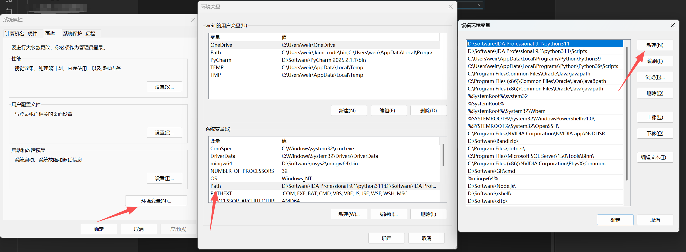
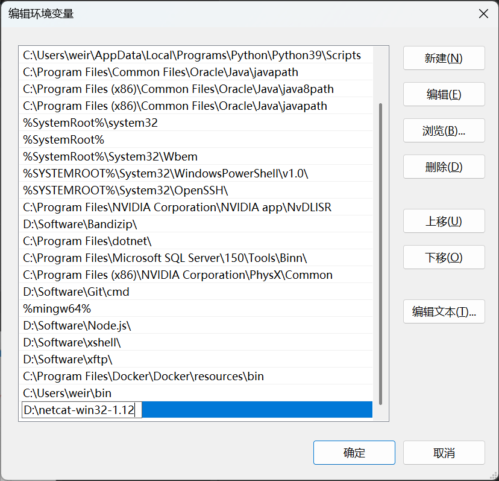
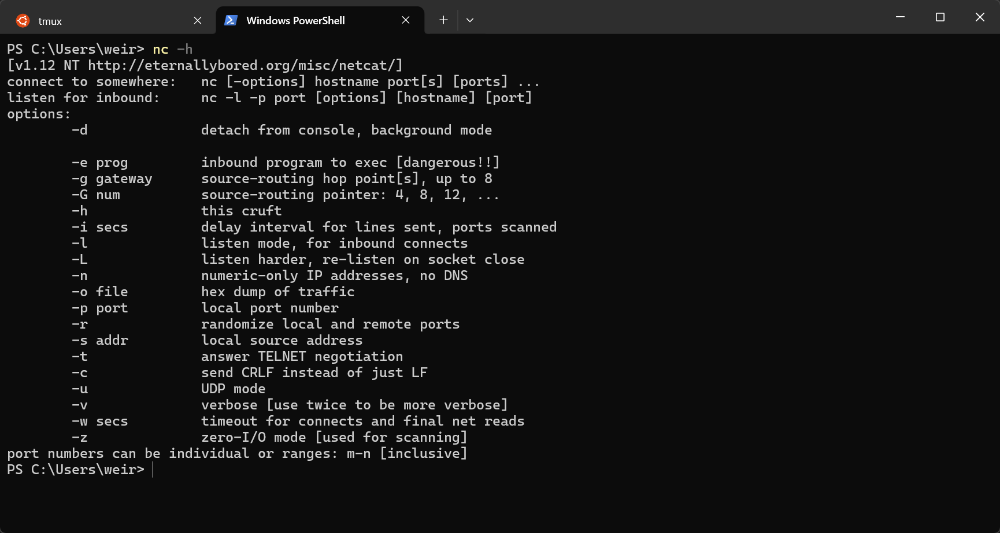

不同于liunx，windows没有原生的nc命令，本文将介绍如何在windows环境下安装nc命令

在这个网站(https://eternallybored.org/misc/netcat/)

点击这个netcat 1.12即可下载
下载完成后，解压缩这个压缩包，将其解压至例如D盘等其他盘符中，且包含的文件夹中，最好不要有中文名

选中这个路径，并复制

使用任务栏的搜索框，搜索环境变量，并点击打开

从左到右的顺序，依次点击环境变量-Path-新建

会在最后一栏新建一个框，我们把将复制的路径粘贴进去
最后依次确认退出即可
在这之后，鼠标任意右键文件夹或是桌面

点击在终端中打开

输入nc -h，如果与上图一样的输出，说明nc已经添加到环境变量了
之后即可正常使用nc命令