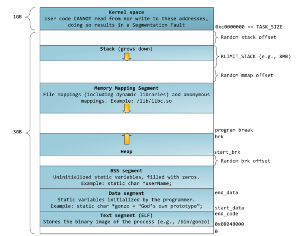
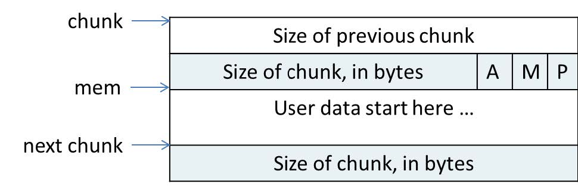
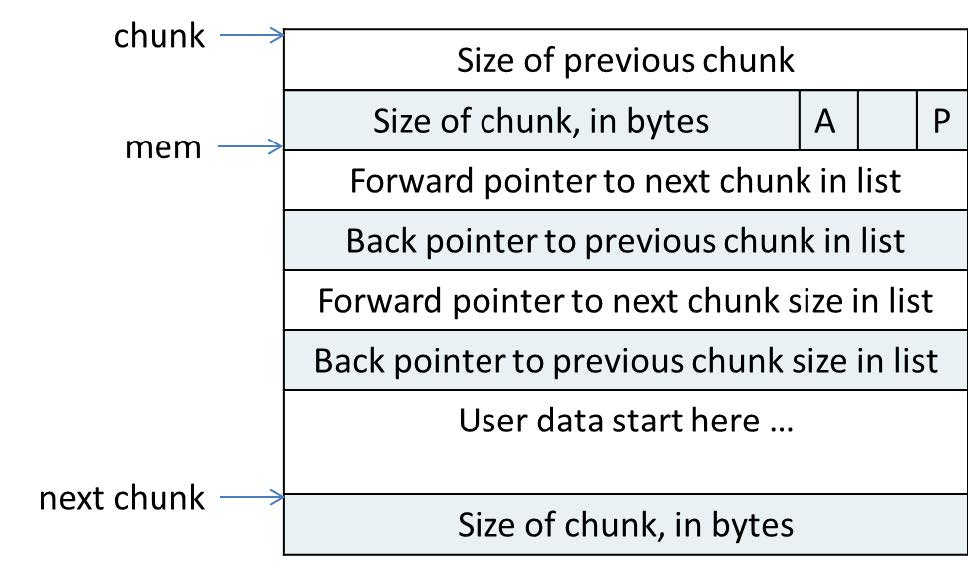
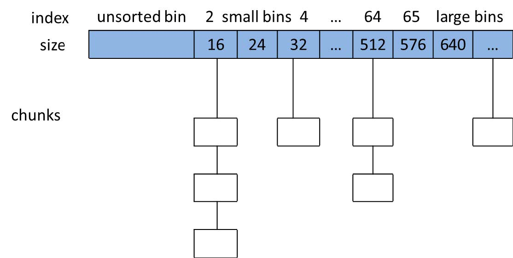

终于到堆了，其实是最近的比赛老是出堆，给我整急了😠
这篇文章的注释大部分都是ai写的，毕竟我也只是个正在学习的菜鸡，这篇文章更多的是我在学习堆的记录

如果有不正确的地方，欢迎师傅发邮件与我联系(weir_su@163.com)

# 前言
栈是有局限性的，虽然它存放和读取数据的速度很快，但是，栈的大小是有限的，在64位系统上，栈的大小通常为2MB，如果我们需要存放一个很大的数据，或者是我们一开始不知道要多少内存来存放数据，那么我们就不能再在栈上放，我们得另外找一个地方放我们的数据，于是我们就创造出了一个堆区，它的大小是动态调整的
这里来张经典的图


在这里推荐一个视频
[99%的程序员都该补的底层课：彻底弄懂Stack（栈）与Heap（堆）| 栈的局限 / 系统调用 / 性能优化 / 内存布局 / 内存碎片 / 指针](https://www.bilibili.com/video/BV1kZsbzYE7J/?spm_id_from=333.337.search-card.all.click&vd_source=d3aeb1f8fcdb82c12b0610f95b84f441)
我建议刚开始学堆的师傅都可以来看看这个视频，至少对我而言，这个视频给我补全了一些前置概念和条件
由于系统调用比较昂贵，如果一个程序需要频繁的申请内存时，上下文切换导致的开销是我们不想要的
于是如果程序需要申请内存时，操作系统会划分一大块内存给我们，但是我们并不需要这么大块，这就需要有个"管理员"来维护并且切割内存，在linux系统上，这个"管理员"叫ptmalloc
我们都只知道用malloc函数申请一块内存，返回的是一个指针，当不需要这个内存时，我们就用free函数将这个内存块释放掉，但是我们并不知道是怎么分配和回收的，下面我们来看看malloc是怎么申请内存的
(如无特殊说明，接下来的介绍都是以64位系统为基准)
(如无特殊说明，接下来所说的上一个，下一个指的是逻辑上（链表）的方向。而前一个，后一个指的是内存上的方向)

# 基本概念

## Chunk

### chunk的结构
用户在堆上申请内存时，ptmalloc并不是简单的在堆上找到一块区域，然后返回一个指针给用户，这非常不方便管理，所以ptmalloc定义了一个结构体——chunk，有点像一个快递盒或者有点打包那种感觉，这样将内存分为一个个大小不一的chunk方便管理
我们来看看chunk这个结构体的源码
```c
struct malloc_chunk {

  INTERNAL_SIZE_T      prev_size;  /* Size of previous chunk (if free).  */
  INTERNAL_SIZE_T      size;       /* Size in bytes, including overhead. */

  struct malloc_chunk* fd;         /* double links -- used only if free. */
  struct malloc_chunk* bk;

  /* Only used for large blocks: pointer to next larger size.  */
  struct malloc_chunk* fd_nextsize; /* double links -- used only if free. */
  struct malloc_chunk* bk_nextsize;
};
```


在图中，chunk指针指向一个chunk的开始，一个chunk中包含了用户请求的内存区域和相关的控制信息。图中的mem指针才是真正返回给用户的内存指针。
堆是由低地址往高地址增长的，我们所说的前一个chunk，其实是内存地址上比他小的那个chunk
由于规定了chunk的大小必须是16字节对齐的，size的低三位永远是0，于是就拿这三位来作标识位
chunk的第二个域的最低一位为P，它表示前一个块是否在使用中，P为0则表示前一个chunk为空闲，这时 chunk的第一个域prev_size才有效，prev_size表示前一个chunk的size，程序可以使用这个值来找到前一个chunk的开始地址。当P为1时，表示前一个chunk正在使用中，prev_size无效，程序也就不可以得到前一个chunk的大小。不能对前一个chunk进行任何操作。ptmalloc分配的第一个块总是将P设为1，以防止程序引用到不存在的区域。
Chunk的第二个域的倒数第二个位为M，他表示当前chunk是从哪个内存区域获得的虚拟内存。M为1表示该chunk是从mmap映射区域分配的，否则是从heap区域分配的。
Chunk的第二个域倒数第三个位为A，表示该chunk属于主分配区或者非主分配区，如果属于非主分配区，将该位置为1，否则置为0。
`INTERNAL_SIZE_T`被宏定义为size_t，在64位系统下为unsigned long long 即8字节
`prev_size`表示前一个chunk的大小，`size`表示这个块的大小(16字节加user data)
如果这个堆块在使用中是如上图所示的
其实我觉得这样子定义的堆块怪怪的，你的prev_size实际上是物理上相邻的堆块的user data下面的那个size of chunk，如果这个堆块在使用中，fd,bk什么的都不存在，都给了user data
下面我们来看当一个chunk空闲(free)之后是怎样的



当chunk空闲时，其M状态不存在，只有AP状态，原本是用户数据区的地方存储了四个指针，指针fd指向下一个空闲的chunk，而bk指向上一个空闲的chunk，ptmalloc通过这两个指针将大小相近的chunk连成一个双向链表。对于large bin中的空闲chunk，还有两个指针，fd_nextsize和bk_nextsize，这两个指针用于加快在large bin中查找最近匹配的空闲chunk。不同的chunk链表又是通过bins或者fastbins来组织的，各种bin的概念我们之后会介绍到。

值得一提的是，堆是由低地址往高地址增长的，所以prev_size是放在低地址的，而在计算机内存中，地址是从0开始向大的数值增长的。我们可以把内存看作一条从左到右的数轴，所以向后是指地址减小的方向，向前是指地址增加的方向，再来看看我们一开始的内存布局图，从直觉上来说会有点怪怪的，因为prev_size是放在低地址的，从主观来说，我们会因为prev_size的名字而认为低地址的是前一个chunk，但是实质上是后一个chunk


### chunk的内存复用
为了使得 chunk 所占用的空间最小，ptmalloc使用了空间复用，一个 chunk或者正在被使用，或者已经被free掉，所以chunk的中的一些域可以在使用状态和空闲状态表示不同的意义，来达到空间复用的效果。以64位系统为例，空闲时，一个chunk中至少需要4个size_t（8B）大小的空间，用来存储prev_size，size，fd和bk （见上图），也就是32B，chunk的大小要对齐到16B。
当一个chunk 处于使用状态时，它的下一个chunk 的prev_size域肯定是无效的。所以实际上，这个空间也可以被当前chunk 使用。这听起来有点不可思议，但确实是合理空间复用的例子
所以ptmalloc理论上要划分的内存大小为16加上用户所申请的大小对齐16字节，但是有了内存复用，可以将下个chunk的prev_size字段作为data，于是ptmalloc只需要准备8加用户申请的字节对齐十六字节就可以了，少的那八字节借用下个chunk的prev_size
## 主分配区与非主分配区

即main_arena和non_main_arena，这其实是个结构体，主分配区在libc里。非主分配区在mmap段上，主分配区和非主分配区解决的是多线程的问题，但在pwn题中，主要都是单线程的题目，所以我们可以先不管非主分配区，专注于主分配区。

主分配区是一个结构体，它在libc的data段上，是malloc_state的一个实例
那我们先来看看malloc_state这个结构体
`mfastbinptr`和`mchunkptr`都是由`malloc_chunk`定义的指针变量
```c
struct malloc_state
{
  /* Serialize access.  */
  mutex_t mutex;//一个互斥锁，主要用于防止多线程竞争

  /* Flags (formerly in max_fast).  */
  int flags;

  /* Fastbins */
  mfastbinptr fastbinsY[NFASTBINS];//这是一个存放fastbin链表头的数组。

  /* Base of the topmost chunk -- not otherwise kept in a bin */
  mchunkptr top;//定义了一个top chunk，我们之后会介绍

  /* The remainder from the most recent split of a small request */
  mchunkptr last_remainder;//主要用于Small Bin的拆分。我们之后会介绍

  /* Normal bins packed as described above */
  mchunkptr bins[NBINS * 2 - 2];
  /*这是堆管理中最复杂的地方。虽然数组名是 `bins`，但它实际上存储的是**双向链表**的表头。*/

  /* Bitmap of bins */
  unsigned int binmap[BINMAPSIZE];
  /*这是一个位图（Bitmap）作用:为了提高性能。每一位代表对应的 bin 是否为空。在 malloc 寻找合适大小的 bin 时，通过位运算可以极快地跳过那些空的 bin，而不用一个一个去检查指针。

  /* Linked list */
  struct malloc_state *next;
  /*全局的Arena链表，指向下一个arena，和多线程有关*/

  /* Linked list for free arenas.  Access to this field is serialized
     by free_list_lock in arena.c.  */
  struct malloc_state *next_free;
  /*下一个空闲的arena*/

  /* Number of threads attached to this arena.  0 if the arena is on
     the free list.  Access to this field is serialized by
     free_list_lock in arena.c.  */
  INTERNAL_SIZE_T attached_threads;
  /*功能：记录当前有多少个线程正连接到（Attached）这个 Arena 上。*/

  /* Memory allocated from the system in this arena.  */
  INTERNAL_SIZE_T system_mem;
  //当前 Arena 从操作系统（通过 `sbrk` 或 `mmap`）申请的总内存量。
  INTERNAL_SIZE_T max_system_mem;
  //该 Arena 曾经达到的系统内存峰值。
};
```
再来看主分配区是怎么被定义的
```c
static struct malloc_state main_arena =
{
  .mutex = _LIBC_LOCK_INITIALIZER,
  .next = &main_arena,
  .attached_threads = 1
};
```

## Bins

就是垃圾桶()
被free 掉的内存并不是都会马上归还给系统，ptmalloc 会统一管理heap和mmap 映射区域中的空闲的chunk，当用户进行下一次分配请求时，ptmalloc 会首先试图在空闲的
chunk 中挑选一块给用户，这样就避免了频繁的系统调用，降低了内存分配的开销。
ptmalloc将相似大小的chunk 用双向链表链接起来，这样的一个链表被称为一个bin。
那么具体怎么管理这个bins呢？ptmalloc根据bin中所存放的chunk的大小，划分了四种bins，
分别是fast bins，unsorted bins，small bins 和 large bins。
并且在主分配区定义了一个数组来存放这个bins(`mchunkptr bins[NBINS * 2 - 2]`)
如下图所示

	数组中的第一个为unsorted bin，数组中从2开始编号的前64个bin称为small bins，同
一个small bin中的chunk 具有相同的大小。两个相邻的small bin中的chunk大小相差8bytes。
small bins 中的chunk按照最近使用顺序进行排列，最后释放的chunk被链接到链表的头部，
而申请chunk是从链表尾部开始，这样，每一个chunk 都有相同的机会被ptmalloc 选中。
Small bins 后面的bin被称作large bins。large bins中的每一个bin分别包含了一个给定范围
内的chunk，其中的chunk 按大小序排列。相同大小的chunk同样按照最近使用顺序排列。
ptmalloc使用“smallest-first，best-fit”原则在空闲large bins中查找合适的chunk。
	当空闲的chunk 被链接到bin 中的时候，ptmalloc 会把表示该chunk 是否处于使用中的
标志P 设为0（注意，这个标志实际上处在下一个chunk 中），同时ptmalloc 还会检查它前
后的chunk 是否也是空闲的，如果是的话，ptmalloc 会首先把它们合并为一个大的chunk，
然后将合并后的chunk 放到unstored bin 中。要注意的是，并不是所有的chunk 被释放后就
立即被放到bin 中。ptmalloc 为了提高分配的速度，会把一些小的的chunk 先放到一个叫做
fast bins 的容器内。
### Fast Bins
  一般的情况是，程序在运行时会经常需要申请和释放一些较小的内存空间。当分配器合
并了相邻的几个小的chunk 之后，也许马上就会有另一个小块内存的请求，这样分配器又需
要从大的空闲内存中切分出一块，这样无疑是比较低效的，故而，ptmalloc 中在分配过程中
引入了fast bins，不大于`global_max_fast`的chunk 被释放后，首先会被放到fast bins
中，fast bins中的chunk并不改变它的使用标志P。这样也就无法将它们合并，当需要给用
户分配的chunk小于或等于max_fast时，ptmalloc 首先会在fast bins中查找相应的空闲块，
然后才会去查找bins中的空闲chunk。在一些特定的时候，ptmalloc会遍历fast bins中的chunk，将相邻的空闲chunk进行合并，并将合并后的chunk加入unsorted bin中，然后再将usorted
bin里的chunk加入bins中。
  Fast bins主要是用于提高小内存的分配效率，对于64位系统来说，小于128B的chunk请求，首
先会查找fast bins 中是否有所需大小的chunk 存在（精确匹配），如果存在，就直接返回。
  Fast bins 可以看着是small bins的一小部分cache，默认情况下，fast bins 只cache 了small
bins 的前7个大小的空闲chunk，也就是说对于SIZE_SZ 为8B 的平台，fast bins 有7个chunk 空闲链表（bin），每个bin的chunk大小依次为32B，48B，64B，80B，96B，112B，128B。
 与其他三个bins不同,fast bins可以看成是先进后出的栈，使用单项链表实现，而其他三个bins都是先进先出(FIFO)
### Small Bins
Small bins 用于存放固定大小的chunk，共64个bin，最小的chunk大小为32 字节，每个bin的大小相差16字节，当分配小内存块时，采用精确匹配的方式从small bins 中查找合适的chunk
每个small bin中的chunk的大小与bin的index有如下关系：`Chunk_size=2 * SIZE_SZ * index`
在SIZE_SZ 为8B的平台上，small bins中的chunk大小是以16B为公差的等差数列，最大的chunk 大小为1008B，最小的chunk大小为32B，所以实际共62个bin。分别为32B、48B、64B，......，1008B。
small bins是双向循环链表（每个链表都具有链表头节点，加头节点的最大作用就是便于对链表内节点的统一处理，即简化编程），ptmalloc 维护了62 个small bins，每一个链表内的各空闲chunk 的大小一致，因此当应用程序需要分配某个字节大小的内存空间时直接在对应的链表内取就可以了，这样既可以很好的满足应用程序的内存空间申请请求而又不会出现太多的内存碎片。
### Unsorted Bin
unsorted bin在bins数组的第一个位置，如果被用户释放的chunk大于max_fast，或者fast bins中的空闲chunk合并后，这些chunk首先会被放到unsorted bin中，在进行malloc操作的时候，如果在fast bins 中没有找到合适的chunk，则ptmalloc会先在unsorted bin中查找合适的空闲chunk，然后才查找bins。如果unsorted bin不能满足分配要求，malloc便会将unsorted bin中的chunk加入bins 中，然后再从bins中继续进行查找和分配过程。从这个过程可以看出来，unsorted bin可以看做是bins的一个缓冲区，增加它只是为了加快分配的速度。
### Large Bins
Large Bins是一个双向双重循环链表，它有fd,bk和fd_nextsize和bk_nextsize两套指针
Large Bins一共有63个bin（从 bin 64 到 bin 126），不同于small bins，每个large bin负责的是一个大小范围，也正因每个large bin负责的是一个大小范围，fd_nextsize和bk_nextsize才只用于此，这两个指针形成了一个简易的“跳表”结构，这可以加快检索合适chunk的速度
Large Bin 链表内部是按**Size 从大到小**排序的：链表头部存放该Bin范围内最大的chunk，链表尾部存放该Bin范围内最小的chunk
如果两个chunk的Size完全相同：新加入的chunk会被插入到Size相同的chunk队列的**后面**，这意味着在Size相同的情况下，先释放的chunk先被复用
## 特殊的chunk

并不是所有的chunk都按照上面的方式来组织，实际上，有三种例外情况。Top chunk，mmaped chunk 和last remainder，下面会分别介绍这三类特殊的chunk。top chunk对于主分配区和非主分配区是不一样的。
### Top chunk
Top Chunk 是当前堆段中**最后剩余的、未分配的一块连续内存**。它始终位于整个堆空间的最高地址且不属于任何一个Bin列表
当所有的 Bin（如 fastbins, smallbins, unsorted bin 等）都无法满足用户的内存申请需求时，`malloc` 就会尝试从 Top Chunk 中“切”出一块内存给用户。如果 Top Chunk 的大小不足以覆盖请求（Size < nb），主分配区会通过调用 `sbrk()`（或在某些情况下使用 `mmap`）向操作系统申请更多的虚拟内存页，并将新申请的空间合并到原来的 Top Chunk 中，然后再进行分配。
在释放与top chunk相邻的chunk后，会将这个chunk合并至top chunk，如果top chunk变得非常大（超过了 `M_TRIM_THRESHOLD`），ptmalloc可能会调用malloc_trim将一部分内存还给操作系统。
### Mmap chunk
当需要分配的chunk 足够大，而且fast bins 和bins 都不能满足要求，甚至top chunk本
身也不能满足分配需求时，ptmalloc 会使用mmap 来直接使用内存映射来将页映射到进程空
间。这样分配的chunk在被free时将直接解除映射，于是就将内存归还给了操作系统，再次对这样的内存区的引用将导致段错误。这样的chunk也不会包含在任何bin中
# Last remainder
Last remainder是另外一种特殊的chunk，就像top chunk和mmaped chunk一样，不会在任何bins中找到这种chunk。当需要分配一个small chunk，但在small bins中找不到合适的chunk，
malloc会遍历unsorted bin，如果在 Unsorted Bin 中找到一个足够大的 Chunk，`malloc` 会将其分割：前半部分会分配给用户。后半部分：即Last Remainder。它会被重新放回 Unsorted Bin中，并且main_arena中的`last_remainder`指针会更新并指向它
# Malloc
在malloc.c的末尾，定义了一些强别名
```c
strong_alias (__libc_malloc, __malloc) strong_alias (__libc_malloc, malloc)
```
也就是说，当我们在调用malloc的时候，其实是在调用`__libc_malloc`，所以我们来看看`__libc_malloc`的源码
## \_\_libc_malloc
```c
__libc_malloc (size_t bytes)
{
  mstate ar_ptr;      /* 分配区（Arena）状态指针 */
  void *victim;       /* 最终指向分配给用户的内存地址 */

  /* 读取 __malloc_hook 钩子函数。
     atomic_forced_read 确保原子性读取，防止多线程下的竞态问题。
  */
  void *(*hook) (size_t, const void *)
    = atomic_forced_read (__malloc_hook);

  /* __builtin_expect 是编译器优化：暗示 hook 通常为 NULL（0）。
     如果 hook 不为空（即用户设置了自定义分配函数），则执行 hook 并直接返回。
  */
  if (__builtin_expect (hook != NULL, 0))
    return (*hook)(bytes, RETURN_ADDRESS (0));

  /* 获取一个可用的分配区（Arena），并对其加锁。
     ar_ptr 会指向选定的 arena。
  */
  arena_get (ar_ptr, bytes);

  /* 调用核心分配函数 _int_malloc 在指定的 arena 中尝试分配内存 */
  victim = _int_malloc (ar_ptr, bytes);

  /* 仅当我们之前能找到可用的分配区，但分配却失败了（victim 为空）时，
     尝试更换另一个分配区重试。
  */
  if (!victim && ar_ptr != NULL)
    {
      /* 这是一个 SystemTap 探测点，用于监控 malloc 的重试行为 */
      LIBC_PROBE (memory_malloc_retry, 1, bytes);
      
      /* 尝试寻找并锁定另一个不同的 arena */
      ar_ptr = arena_get_retry (ar_ptr, bytes);
      
      /* 在新的 arena 中再次尝试分配 */
      victim = _int_malloc (ar_ptr, bytes);
    }

  /* 如果成功获取了 arena 锁，在此处释放（解锁） */
  if (ar_ptr != NULL)
    (void) mutex_unlock (&ar_ptr->mutex);

  /* 断言检查：确保要么没分到内存，要么分到的内存是 mmap 出来的，
     要么该内存块确实属于它被分配时所在的那个 arena。
  */
  assert (!victim || chunk_is_mmapped (mem2chunk (victim)) ||
          ar_ptr == arena_for_chunk (mem2chunk (victim)));

  return victim; /* 返回用户内存指针 */
}
```
可以看到__libc_malloc是对`int_malloc`的封装，分配内存的核心在于`int_malloc`
下面我们来看int_malloc的源码，由于这个函数很长，我们将分几个部分介绍
## \_int_malloc
```c
static void *
_int_malloc (mstate av, size_t bytes)
{
  INTERNAL_SIZE_T nb;               /* 规范化后的请求大小 (normalized request size) */
  unsigned int idx;                 /* 关联的 bin 索引 */
  mbinptr bin;                      /* 关联的 bin 指针 */

  mchunkptr victim;                 /* 正在检查/被选中的 chunk */
  INTERNAL_SIZE_T size;             /* 该 chunk 的大小 */
  int victim_index;                 /* 该 chunk 所在的 bin 索引 */

  mchunkptr remainder;              /* 分割后剩余的 chunk (remainder) */
  unsigned long remainder_size;     /* 剩余 chunk 的大小 */

  unsigned int block;               /* 用于遍历 binmap 的块索引 */
  unsigned int bit;                 /* 用于遍历 binmap 的位索引 */
  unsigned int map;                 /* binmap 当前处理的字 (word) */

  mchunkptr fwd;                    /* 用于链表操作的临时指针（前向） */
  mchunkptr bck;                    /* 用于链表操作的临时指针（后向） */

  const char *errstr = NULL;        /* 错误信息字符串 */
```
这些是int_malloc定义的临时变量，我们往下走
```c
  /*
	由于size_t是一个无符号整数，因此，当我们申请一个足够大的内存的时候，可能会发生整数溢出，
	这会有安全隐患。
	checked_request2szie就是一个安全检查的函数，这个函数将会判断用户请求的字节数是否合法，
	通常是要小于size_max的一般左右，
	如果合法，将会计算转换成malloc内部使用的物理块大小(nb)，否则返回0。
  */

  checked_request2size (bytes, nb);

  /* 如果没有可用的分配区（arena）。回退到使用 sysmalloc 
     通过 mmap 直接获取一个 chunk。 */
  if (__glibc_unlikely (av == NULL))
    {
      void *p = sysmalloc (nb, av);
      if (p != NULL)
        alloc_perturb (p, bytes);
      return p;
    }
```
接下来就是在主分配区分配内存的情况，首先是——
### 在fast bins中分配内存
```c
   /*
     如果用户申请的内存大小符合 fastbin 的标准，首先检查对应的 bin。
     即使 av（arena 状态）尚未初始化，执行这段代码也是安全的，
     所以我们可以不加检查地直接尝试，这在快速路径（fast path）上节省了一些时间。
   */

  /* 1. 判断请求大小 nb 是否小于等于 fastbin 允许的最大值 */
  if ((unsigned long) (nb) <= (unsigned long) (get_max_fast ()))
    {
      /* 2. 根据大小计算该 chunk 应该在哪个 fastbin 数组索引中 */
      idx = fastbin_index (nb);
      /* 3. 获取该索引对应的 fastbin 链表头部的指针地址 */
      mfastbinptr *fb = &fastbin (av, idx);
      /* 4. 读取当前的链表头结点 */
      mchunkptr pp = *fb;
      do
        {
          victim = pp;
          /* 5. 如果链表为空（NULL），说明该 bin 里没有空闲块，跳出循环去走别的路径 */
          if (victim == NULL)
            break;
        }
      /* 6. 核心原子操作：尝试将链表头从 victim 切换到 victim->fd (即弹出栈顶)
         使用了无锁编程中的 CAS (Compare and Swap) 机制，防止多线程竞争。
         如果在此期间别的线程改了 *fb，则继续循环重试。
      */
      while ((pp = catomic_compare_and_exchange_val_acq (fb, victim->fd, victim))
             != victim);

      /* 7. 如果成功拿到了一个空闲块 (victim) */
      if (victim != 0)
        {
          /* 8. 安全检查：检查拿到的这个 chunk 的大小是否真的属于这个 bin。
             如果大小不匹配，说明堆内存被破坏了（可能是溢出修改了 header）。
          */
          if (__builtin_expect (fastbin_index (chunksize (victim)) != idx, 0))
            {
              errstr = "malloc(): memory corruption (fast)";
            errout:
              malloc_printerr (check_action, errstr, chunk2mem (victim), av);
              return NULL;
            }
          /* 9. 调试相关的检查宏 */
          check_remalloced_chunk (av, victim, nb);
          /* 10. 将 chunk 指针转换为用户数据区指针 (mem) */
          void *p = chunk2mem (victim);
          /* 11. 如果开启了扰动特性，填充内存以助调试 */
          alloc_perturb (p, bytes);
          return p; /* 成功分配，直接返回！ */
        }
    }
```
如果申请的大小超过了max_fast，或者是fast bins中没有合适的chunk，则会进入下一步——
### 在small bins中分配内存
```c
   /*
     如果是小请求，检查常规 bin。由于这些 "smallbins"
     每个只存放一种大小的块，因此不需要在 bin 内部进行搜索。
     （对于大请求，我们需要等待处理完 unsorted chunks 以找到最佳匹配。
     但对于小请求，匹配结果横竖都是精确的，所以我们可以现在就检查，这样更快。）
   */

  /* 1. 检查请求大小 nb 是否在 smallbin 的范围内（通常 < 1024 字节） */
  if (in_smallbin_range (nb))
    {
      /* 2. 获取该大小对应的 smallbin 索引 */
      idx = smallbin_index (nb);
      /* 3. 定位到该 bin 的头部指针 */
      bin = bin_at (av, idx);

      /* 4. 获取 bin 链表中的最后一个块 (victim = last(bin))。
         注意：Small bins 是双向循环链表，如果 last(bin) == bin，说明链表为空。
      */
      if ((victim = last (bin)) != bin)
        {
          /* 5. 如果 victim 为 0，说明 malloc 还没有初始化（通常发生在首次调用） */
          if (victim == 0) 
            malloc_consolidate (av); /* 合并并初始化 */
          else
            {
              /* 6. 获取 victim 的前一个块（在双向链表中是 bck） */
              bck = victim->bk;
              
              /* 7. 【安全检查】极其重要！检查双向链表的完整性。
                 正常情况下，victim->bk->fd 应该指向 victim。
                 如果不是，说明链表被非法篡改（堆溢出攻击常见手段）。
              */
              if (__glibc_unlikely (bck->fd != victim))
                {
                  errstr = "malloc(): smallbin double linked list corrupted";
                  goto errout;
                }
              
              /* 8. 设置标志位：告诉下一个物理邻居，本块（victim）正被使用 */
              set_inuse_bit_at_offset (victim, nb);
              
              /* 9. 将 victim 从 Small Bin 链表中拆卸（Unlink） */
              bin->bk = bck;
              bck->fd = bin;

              /* 10. 如果不是主分配区（Main Arena），设置相应的标志位 */
              if (av != &main_arena)
                victim->size |= NON_MAIN_ARENA;
              
              /* 11. 调试检查与指针转换，返回内存 */
              check_malloced_chunk (av, victim, nb);
              void *p = chunk2mem (victim);
              alloc_perturb (p, bytes);
              return p;
            }
        }
    }
    /*
     如果没有通过这个if判断
     那么这会是一个大请求（Large Request）
     在继续去分配内存前，我们先合并 fastbins。
     虽然在还没看large bins有没有可用空间之前就清空所有 fastbins 看起来有些过头，
     但这避免了通常与 fastbins 相关的碎片化问题。
     此外，在实践中，程序往往倾向于连续进行一系列小请求或大请求，
     而较少混合使用，因此在大多数程序中，合并操作并不会被频繁调用。
     而在那些频繁调用合并的程序中，如果不这样做，往往会产生严重的碎片。
   */

  else
    {
      /* 1. 计算大块对应的 Large Bin 索引 */
      idx = largebin_index (nb);
      
      /* 2. 检查当前 Arena 是否有 Fastbins 块 */
      if (have_fastchunks (av))
        /* 3. 如果有，立刻进行合并（Consolidate）！
           这会将 Fastbins 里的块归还并尝试与邻居合并，放入 Unsorted Bin 中。
        */
        malloc_consolidate (av);
    }
```
如果small bins无法满足用户的申请，那么这肯定是一个较大的请求，接下来——
### 在unsorted bin中分配内存
如果unsorted bin中没有合适的内存，这将清空unsorted bin
这里首先会有一个无限的for循环，这个for循环将持续到__int_malloc的结尾
我们同样分几部分来介绍
#### 1.外部循环与初衷
```c
/*
     处理最近释放的或剩余的（remaindered）块，仅当块完全匹配时才取用；
     或者，如果这是一个小请求，且该块是最近一次非精确匹配产生的剩余块（remainder），则取用。
     将遍历到的其他块放入对应的 bin 中。
     注意，这一步是所有流程中唯一将块放入 bin 的地方。

     这里需要外层循环，是因为我们可能直到 malloc 接近结束时才意识到应该进行合并（consolidate），
     因此必须合并并重试。这种情况最多发生一次，且仅当我们为了满足“小”请求而不得不扩展内存时才会发生。
   */

  for (;;)
    {
      int iters = 0;//一个循环计数器
      /* 遍历 Unsorted Bin 链表。unsorted_chunks(av) 是哨兵节点。
         它以 FIFO（先进先出）顺序从 bk 指针处取块。 */
      while ((victim = unsorted_chunks (av)->bk) != unsorted_chunks (av))
        {
          bck = victim->bk;
          /* 安全检查：块的大小不能太小，也不能超过系统总内存 */
          if (__builtin_expect (victim->size <= 2 * SIZE_SZ, 0)
              || __builtin_expect (victim->size > av->system_mem, 0))
            malloc_printerr (check_action, "malloc(): memory corruption",
                             chunk2mem (victim), av);
          size = chunksize (victim);
```
#### 2.Last Remainder 优化（针对小请求的局部性优化）
```c
		   /*
             如果是小请求，且 Unsorted Bin 中只有这一个块，且它是 last_remainder，
             且大小足够切割：则直接进行切割分配。否则进入下一步
             这有助于连续的小请求在物理内存上保持局部性。
             这是“最佳匹配（best-fit）”策略的唯一例外。
           */
          if (in_smallbin_range (nb) &&
              bck == unsorted_chunks (av) &&
              victim == av->last_remainder &&
              (unsigned long) (size) > (unsigned long) (nb + MINSIZE))
            {
              /* 切割块并重新挂载剩余部分 */
              remainder_size = size - nb;
              remainder = chunk_at_offset (victim, nb);
              /* 将剩余部分放回 Unsorted Bin */
              unsorted_chunks (av)->bk = unsorted_chunks (av)->fd = remainder;
              av->last_remainder = remainder;
              remainder->bk = remainder->fd = unsorted_chunks (av);

              /* 如果现在的last_remainder是一个大块，清空其 nextsize 指针 
                 这是为了防止“脏数据”干扰*/
              if (!in_smallbin_range (remainder_size))
                {
                  remainder->fd_nextsize = NULL;
                  remainder->bk_nextsize = NULL;
                }

              /* 设置 victim（分配给用户）和 remainder（留下的）的 header */
              set_head (victim, nb | PREV_INUSE |
                        (av != &main_arena ? NON_MAIN_ARENA : 0));
              set_head (remainder, remainder_size | PREV_INUSE);
              set_foot (remainder, remainder_size);

              check_malloced_chunk (av, victim, nb);
              void *p = chunk2mem (victim);
              alloc_perturb (p, bytes);
              return p; /* 成功分配并返回 */
            }
```
#### 3.将块移出Unsorted Bin并尝试精确匹配
```c
		/* 将当前块从 Unsorted Bin 链表中移除 */
          unsorted_chunks (av)->bk = bck;
          bck->fd = unsorted_chunks (av);

        /* 如果大小完全符合请求，直接返回，不再放入 bin */
          if (size == nb)
            {
              set_inuse_bit_at_offset (victim, size);
              if (av != &main_arena)
                victim->size |= NON_MAIN_ARENA;
              check_malloced_chunk (av, victim, nb);
              void *p = chunk2mem (victim);
              alloc_perturb (p, bytes);
              return p;
            }
```
#### 4.归位：放入Small Bins或Large Bins
如果没有精确匹配，则将这个块放到Small Bins或者Large Bins
```c
/* 根据大小决定放入 Small Bin 还是 Large Bin */
          if (in_smallbin_range (size))
            {
              victim_index = smallbin_index (size);
              bck = bin_at (av, victim_index);
              fwd = bck->fd;
            }
          else
            {
              victim_index = largebin_index (size);
              bck = bin_at (av, victim_index);
              fwd = bck->fd;

              /* 维护 Large Bins 的排序顺序（从大到小） */
              if (fwd != bck)
                {
                  /* 将 PREV_INUSE 参与比较以微幅加速 */
                  size |= PREV_INUSE;
                  //一个断言检查，检查bck的上一个chunk的size是否是合法的
                  assert ((bck->bk->size & NON_MAIN_ARENA) == 0);
                  /* 如果比当前 bin 中最小的块还要小，直接插到末尾 */
                  if ((unsigned long) (size) < (unsigned long) (bck->bk->size))
                    {
                      fwd = bck;
                      bck = bck->bk;
                      /* 更新 nextsize 链表（用于快速跳过相同大小的块） */
                      /*将victim的fd_nextsize指向最大块*/
                      victim->fd_nextsize = fwd->fd;
                      /*将victim的bk_nextsize指向原来的最小块*/
                      victim->bk_nextsize = fwd->fd->bk_nextsize;
                      /*这里是两个赋值操作*/
                      /*1.让最大块的bk_nextsize指向victim*/
                      /*2.让原来的最小快的fd_nextsize指向victim*/
			          fwd->fd->bk_nextsize = victim->bk_nextsize->fd_nextsize = victim;
                    }
                  else
                    {
                      /* 在 Large Bin 中寻找合适的插入位置 */
                      assert ((fwd->size & NON_MAIN_ARENA) == 0);
                      while ((unsigned long) size < fwd->size)
                        {
                          fwd = fwd->fd_nextsize;
                          assert ((fwd->size & NON_MAIN_ARENA) == 0);
                        }

                      /* 如果大小相等，则插入在同大小块的第二个位置(不进 nextsize 链表)*/
                      if ((unsigned long) size == (unsigned long) fwd->size)
                        fwd = fwd->fd;
                      else
                        {
                          /* 插入新大小的节点到 nextsize 链表 */
                          victim->fd_nextsize = fwd;
                          victim->bk_nextsize = fwd->bk_nextsize;
                          fwd->bk_nextsize = victim;
                          victim->bk_nextsize->fd_nextsize = victim;
                        }
                      bck = fwd->bk;
                    }
                }
              else
                /* 第一个进入该 Large Bin 的块 */
                victim->fd_nextsize = victim->bk_nextsize = victim;
            }

          /* 最终执行插入：将块放入目标 bin 的双向链表 */
          mark_bin (av, victim_index); /* 在 binmap 中标记该 bin 非空 */
          victim->bk = bck;
          victim->fd = fwd;
          fwd->bk = victim;
          bck->fd = victim;

          /* 安全限制：避免在 Unsorted Bin 过长时陷入死循环 */
#define MAX_ITERS        10000
          if (++iters >= MAX_ITERS)
            break;
        }//这个括号匹配的是第一步的while循环
		/*在第3步中，我们将victim移出了unsorted bin，如果这个块并没有精准匹配我们的需求
		那么我们将这个块放到small bins或者large bins中，我们最终的目的是在检查
		unsorted bins中有没有符合用户所需的chunk，于是现在重复第一步操作*/
```
如果unsorted bin中没有符合用户所申请的chunk，那么这将会是一个大的申请，那么就会进行接下来的一步——
### 在large_bins中分配内存
当 **Fastbins**、**Small Bins** 和 **Unsorted Bin** 都没能满足请求，且请求的大小（`nb`）属于 **Large Bin** 范围时，`malloc` 会在这里执行 **Best-Fit（最佳匹配）** 算法。
#### 1.尝试在对应的大小large bins中分配内存
```c
/*
         如果是一个大请求，按排序顺序扫描当前 bin 中的 chunks，
         找到满足条件的最小块。为此使用跳表（skip list）。
       */

      if (!in_smallbin_range (nb))
        {
          /* 获取当前 size 对应的 large bin 头部 */
          bin = bin_at (av, idx);

          /* 如果 bin 为空，或者 bin 中最大的块（第一个块）都比请求的 nb 小，
             则跳过扫描。
           */
          if ((victim = first (bin)) != bin &&
              (unsigned long) (victim->size) >= (unsigned long) (nb))
            {
              /* 由于 large bin 中的 chunks 是按从大到小排序的，
                 first(bin) 指向最大的块。通过 bk_nextsize，
                 我们可以直接跳到该 bin 中【最小】的块，
                 然后从小往大搜，以实现“最佳匹配”。
               */
              victim = victim->bk_nextsize;
              while (((unsigned long) (size = chunksize (victim)) <
                      (unsigned long) (nb)))
                victim = victim->bk_nextsize;

              /* 【性能优化】
                 避免移除某种大小的第一个条目（即跳表节点），
                 这样就不必重新路由跳表（skip list）的指针。
               */
              if (victim != last (bin) && victim->size == victim->fd->size)
                victim = victim->fd;

              remainder_size = size - nb;
              /* 将选中的块从 bin 的双向链表和跳表中移除 */
              unlink (av, victim, bck, fwd);

              /* 耗尽（Exhaust）：如果切割后剩下的部分太小（小于最小 chunk 大小） */
              if (remainder_size < MINSIZE)
                {
                  /* 不进行切割，将整个块给用户，设置 inuse 位 */
                  set_inuse_bit_at_offset (victim, size);
                  if (av != &main_arena)
                    victim->size |= NON_MAIN_ARENA;
                }
              /* 切割（Split） */
              else
                {
                  /* 在 victim 偏移 nb 的地方切出一个新的 remainder */
                  remainder = chunk_at_offset (victim, nb);
                  
                  /* 我们不能假设 unsorted list 是空的，
                     因此必须在这里执行一次完整的插入操作。
                   */
                  bck = unsorted_chunks (av);
                  fwd = bck->fd;
                  
                  /* 【安全检查】检查 unsorted bin 双向链表的完整性 */
                  if (__glibc_unlikely (fwd->bk != bck))
                    {
                      errstr = "malloc(): corrupted unsorted chunks";
                      goto errout;
                    }
                  
                  /* 将 remainder 插入到 unsorted bin 的头部 */
                  remainder->bk = bck;
                  remainder->fd = fwd;
                  bck->fd = remainder;
                  fwd->bk = remainder;
                  
                  /* 如果 remainder 仍然属于 large bin 范围，清空其跳表指针 */
                  if (!in_smallbin_range (remainder_size))
                    {
                      remainder->fd_nextsize = NULL;
                      remainder->bk_nextsize = NULL;
                    }
                  
                  /* 设置分配块（victim）和剩余块（remainder）的头部/脚部信息 */
                  set_head (victim, nb | PREV_INUSE |
                            (av != &main_arena ? NON_MAIN_ARENA : 0));
                  set_head (remainder, remainder_size | PREV_INUSE);
                  set_foot (remainder, remainder_size);
                }
              
              /* 检查、扰动并返回内存指针 */
              check_malloced_chunk (av, victim, nb);
              void *p = chunk2mem (victim);
              alloc_perturb (p, bytes);
              return p;
            }
        }
```
#### 2.更大的bins中分配内存
假如在对应的大小bins中没有合适的chunk，那么就扩大搜索，去更大的bins中寻找可分配的chunk
```c
	   /*
         通过扫描 bins 来寻找块，从下一个更大的 bin 开始。
         这种搜索严格遵循最佳匹配（best-fit）原则；即选择满足条件的
         最小块（如果大小相同，则大致选择最久未使用的那个块）。

         位图（bitmap）避免了检查大多数 bin 是否为空的需要。
         在初始阶段（尚未有块返回时）跳过所有 bin 的特定情况，
         其实际执行速度比看起来要快。
       */

      /* 1. 从当前索引的下一个 bin 开始查找 */
      ++idx;
      bin = bin_at (av, idx);
      block = idx2block (idx); /* 获取该 bin 索引所在的位图块（通常是一个 32 位整数） */
      map = av->binmap[block]; /* 读取该块的位图内容 */
      bit = idx2bit (idx);     /* 获取该索引在位图块中对应的比特位 */

      for (;; )
        {
          /* 2. 如果当前位图块中，从当前 bit 往后没有设置位（即 map 后面的位全为 0） */
          if (bit > map || bit == 0)
            {
              do
                {
                  /* 3. 寻找下一个非零的位图块 */
                  if (++block >= BINMAPSIZE) /* 如果所有 bin 都找遍了 */
                    goto use_top;            /* 绝望了，去求助 top chunk */
                }
              while ((map = av->binmap[block]) == 0);

              /* 4. 找到了一个非空的位图块，重置 bin 指针和 bit 位到该块的起点 */
              bin = bin_at (av, (block << BINMAPSHIFT));
              bit = 1;
            }

          /* 5. 在当前位图块中前进，直到找到被设置为 1 的比特位（代表该 bin 非空） */
          while ((bit & map) == 0)
            {
              bin = next_bin (bin);
              bit <<= 1;
              assert (bit != 0);
            }

          /* 6. 检查这个 bin。它极大概率是非空的 */
          victim = last (bin);

          /* 7. 如果是误报（false alarm，即位图显示有但 bin 实际为空），清除该位并继续 */
          if (victim == bin)
            {
              av->binmap[block] = map &= ~bit; /* 修正位图，写回内存 */
              bin = next_bin (bin);
              bit <<= 1;
            }

          /* 8. 终于找到了真正可用的块！ */
          else
            {
              size = chunksize (victim);

              /* 我们确信这个 bin 里的第一个块肯定足够大（因为它属于更大的 bin） */
              assert ((unsigned long) (size) >= (unsigned long) (nb));

              remainder_size = size - nb;

              /* 9. 从链表中拆卸该块 */
              unlink (av, victim, bck, fwd);

              /* 耗尽（Exhaust）：如果剩下的小碎块不足以作为一个独立 chunk */
              if (remainder_size < MINSIZE)
                {
                  set_inuse_bit_at_offset (victim, size);
                  if (av != &main_arena)
                    victim->size |= NON_MAIN_ARENA;
                }
              /* 切割（Split）：把剩下的部分放回 Unsorted Bin */
              else
                {
                  remainder = chunk_at_offset (victim, nb);

                  /* 同样的，不能假设 unsorted 链表为空 */
                  bck = unsorted_chunks (av);
                  fwd = bck->fd;
                  if (__glibc_unlikely (fwd->bk != bck))
                    {
                      errstr = "malloc(): corrupted unsorted chunks 2";
                      goto errout;
                    }
                  remainder->bk = bck;
                  remainder->fd = fwd;
                  bck->fd = remainder;
                  fwd->bk = remainder;

                  /* 10. 更新 last_remainder 标记，方便下次局部性优化 */
                  if (in_smallbin_range (nb))
                    av->last_remainder = remainder;
                  
                  if (!in_smallbin_range (remainder_size))
                    {
                      remainder->fd_nextsize = NULL;
                      remainder->bk_nextsize = NULL;
                    }
                  
                  /* 设置头尾信息 */
                  set_head (victim, nb | PREV_INUSE |
                            (av != &main_arena ? NON_MAIN_ARENA : 0));
                  set_head (remainder, remainder_size | PREV_INUSE);
                  set_foot (remainder, remainder_size);
                }
              check_malloced_chunk (av, victim, nb);
              void *p = chunk2mem (victim);
              alloc_perturb (p, bytes);
              return p;
            }
        }
```
如果更大的large bins中都没有可以满足用户申请的chunk，那么就进行下一步——
### 在Top Chunk中分配内存
```c
use_top:
      /*
         如果 Top Chunk 足够大，则从边界处切分出一块（Top Chunk 维护在 av->top 中）。
         注意，这符合“最佳匹配（best-fit）”搜索规则。
         实际上，av->top 被视为比任何其他可用 chunk 都大（因此匹配度较低），
         因为它可以在必要时无限扩展（受系统限制）。

         我们要求在初始化后，av->top 必须始终存在（即大小 >= MINSIZE），
         因此，如果它会被当前请求耗尽，就必须对其进行补充。
         （确保其存在的主要原因是：在调用 sysmalloc 时，我们可能需要 MINSIZE 
         大小的空间来放置“栅栏桩（fenceposts）”。）
       */

      /* 1. 获取当前 Arena 的 Top Chunk 指针及大小 */
      victim = av->top;
      size = chunksize (victim);

      /* 2. 检查 Top Chunk 是否足够大：
         除了满足请求的 nb，还必须至少剩下 MINSIZE (通常是 32 字节) 的空间，
         以保证 Top Chunk 不会被完全切没。
      */
      if ((unsigned long) (size) >= (unsigned long) (nb + MINSIZE))
        {
          /* 3. 计算切分后剩下的 Top Chunk 大小 */
          remainder_size = size - nb;
          /* 4. 计算剩下那部分的起始地址（这就是新的 Top Chunk） */
          remainder = chunk_at_offset (victim, nb);
          av->top = remainder;

          /* 5. 设置分配块（victim）的头部信息。
             注意：Top Chunk 永远处于使用状态的前任之后，所以 P 位设为 1。
          */
          set_head (victim, nb | PREV_INUSE |
                    (av != &main_arena ? NON_MAIN_ARENA : 0));
          /* 6. 设置新的 Top Chunk 的头部（大小更新，且 P 位始终为 1） */
          set_head (remainder, remainder_size | PREV_INUSE);

          check_malloced_chunk (av, victim, nb);
          void *p = chunk2mem (victim);
          alloc_perturb (p, bytes);
          return p; /* 恭喜！终于在 Top Chunk 这里拿到了内存 */
        }

      /* 7. 如果 Top Chunk 太小，但当前 Arena 还有 Fastchunks：
         这是一种兜底：虽然之前查过 Bin，但可能有些 Fastbins 的块因为原子操作
         延迟还留在那。这里强制进行一次合并（Consolidate），把碎片凑成大块。
         并将索引重置，再次回到开头检查unsorted bin，small bins和large bins
      */
      else if (have_fastchunks (av))
        {
          malloc_consolidate (av);
          /* 恢复原始的 bin 索引，准备重新开始搜索逻辑 */
          if (in_smallbin_range (nb))
            idx = smallbin_index (nb);
          else
            idx = largebin_index (nb);
          /* 注意：这里没有 return，会因为外层的 for(;;) 循环重新跑一遍搜索 */
        }

      /*
         否则，交给系统相关的逻辑来处理（即申请新堆空间或 mmap）
       */
      else
        {
          /* 8. 最后的希望：sysmalloc。
             它会通过 brk 扩展堆地址空间，或者通过 mmap 申请新内存。
          */
          void *p = sysmalloc (nb, av);
          if (p != NULL)
            alloc_perturb (p, bytes);
          return p; /* 无论成败，这里是 malloc 的出口 */
        }
    }
}
```
至此，int_malloc的内容我们介绍完l
# Free
介绍完malloc后，自然要介绍Free了
和malloc一样，free函数在libc里的名称其实是__libc_free，我们来看
## \_libc_free
```c
void __libc_free (void *mem)
{
  mstate ar_ptr;
  mchunkptr p;                          /* 对应 mem 的 chunk 指针 */

  /* 读取 __free_hook 钩子函数。
     这是 glibc 提供的一个调试/拦截接口。
  */
  void (*hook) (void *, const void *)
    = atomic_forced_read (__free_hook);
  
  /* 如果定义了钩子（hook 不为 NULL），则调用钩子函数并返回。
     __builtin_expect 提示编译器 hook 通常为 NULL。
  */
  if (__builtin_expect (hook != NULL, 0))
    {
      (*hook)(mem, RETURN_ADDRESS (0));
      return;
    }

  /* 如果 mem 为 0（即 free(NULL)），则不执行任何操作。
     C 标准规定 free(NULL) 是合法的且无副作用。
  */
  if (mem == 0)                               /* free(0) 没有效果 */
    return;

  /* 将用户空间的指针 mem 转换为指向 chunk 头部的指针 p。
     即：p = mem - (2 * SIZE_SZ)
  */
  p = mem2chunk (mem);

  /* 处理通过 mmap 分配的块。
     这种块不属于任何 arena，而是直接通过系统调用释放。
  */
  if (chunk_is_mmapped (p))                       /* 释放 mmapped 内存。 */
    {
      /* 检查是否需要动态调整 brk/mmap 的阈值。
         如果设置了允许动态调整，且当前块的大小在一定范围内。
      */
      if (!mp_.no_dyn_threshold
          && p->size > mp_.mmap_threshold
          && p->size <= DEFAULT_MMAP_THRESHOLD_MAX)
        {
          /* 动态提高 mmap 阈值：如果用户频繁 free 这种大型块，
             malloc 会学习并提高阈值，减少未来 mmap/munmap 的系统调用开销。
          */
          mp_.mmap_threshold = chunksize (p);
          mp_.trim_threshold = 2 * mp_.mmap_threshold;
          /* 系统监控探测点 */
          LIBC_PROBE (memory_mallopt_free_dyn_thresholds, 2,
                      mp_.mmap_threshold, mp_.trim_threshold);
        }
      /* 直接调用内核接口解除映射 */
      munmap_chunk (p);
      return;
    }

  /* 获取该 chunk 所属的分配区（Arena）。 */
  ar_ptr = arena_for_chunk (p);
  
  /* 进入核心释放逻辑：_int_free。
     这里的 0 表示不是由特殊情况（如回退）调用的。
  */
  _int_free (ar_ptr, p, 0);
}
```
同理核心函数还是`_int_free`，`_libc_free`是对`_int_free`的简单包装，我们来看`_int_free`
## \_int_free
同样的，这个函数比较长，我们分几个部分来介绍
首先是开头定义的临时变量
### 临时变量及安全检查
```c
static void
_int_free (mstate av, mchunkptr p, int have_lock)
{
  INTERNAL_SIZE_T size;        /* 块的大小 */
  mfastbinptr *fb;             /* 关联的 fastbin 链表头指针 */
  mchunkptr nextchunk;         /* 物理内存上紧邻的下一个 chunk */
  INTERNAL_SIZE_T nextsize;    /* 下一个块的大小 */
  int nextinuse;               /* 如果下一个块正在使用中，则为 true */
  INTERNAL_SIZE_T prevsize;    /* 物理内存上紧邻的前一个 chunk 的大小 */
  mchunkptr bck;               /* 用于链表链接的各种临时指针 */
  mchunkptr fwd;               /* 用于链表链接的各种临时指针 */

  const char *errstr = NULL;   /* 错误信息字符串 */
  int locked = 0;              /* 锁定状态标志位 */

  /* 提取当前 chunk 的真实大小（屏蔽掉低 3 位的标志位 P, M, A） */
  size = chunksize (p);
```
我们来看下面的处理
首先是安全检查，检查size是否被恶意篡改成一个很大的值，传来的chunk指针是否是16字节对齐
size是否太小或者没有对齐
```c
/* 小小的安全检查，不会损害性能：
     分配器永远不会在地址空间的末尾绕回（wrap around）。
     因此，我们可以排除一些可能因意外或由某些入侵者“设计”而出现在这里的 size 值。 */

  /* 1. 检查地址回绕溢出
	  这里主要是检查size有否被篡改，如果size被修改成了一个很大的值，那么free在检查其物理相邻
	  的chunk时候空闲时，用当前chunk的地址加size，很有可能发生地址回绕，这有很大的安全隐患
     (uintptr_t) -size 等于2^64 - size，这里判断如果指针p的值>2^64 - size
     即p的值+size>2^64，这将会会发生整数溢出
  */
  if (__builtin_expect ((uintptr_t) p > (uintptr_t) -size, 0)
      /* 2. 检查 chunk 指针是否对齐
         在 64 位系统上，指针必须以 16 字节对齐。
      */
      || __builtin_expect (misaligned_chunk (p), 0))
    {
      errstr = "free(): invalid pointer";
    errout:
      /* 如果出错时已经拿到了锁，先解锁 */
      if (!have_lock && locked)
        (void) mutex_unlock (&av->mutex);
      /* 报错并终止程序 */
      malloc_printerr (check_action, errstr, chunk2mem (p), av);
      return;
    }

  /* 我们知道每个 chunk 的大小至少为 MINSIZE 字节，
     或者是 MALLOC_ALIGNMENT 的整数倍。 */

  /* 3. 检查 size 是否太小，或者 size 本身没有对齐 */
  if (__glibc_unlikely (size < MINSIZE || !aligned_OK (size)))
    {
      errstr = "free(): invalid size";
      goto errout;
    }

  /* 调试相关的宏：检查这个即将被释放的 chunk 是否真的被标记为“使用中” */
  check_inuse_chunk(av, p);
```
简单的安全检查后，则会正式开始回收，首先是检查是否符合fast bin的大小，符合则回收至fast bin
### 回收至fast bins
这里的操作追求极致的快:**不合并物理相邻的块，不清除 P 位，甚至在大多数情况下连锁都不用加**。
```c
/* 如果块的大小符合 fastbin 的标准（足够小），
     则将其放入 fastbin，以便在 malloc 中被快速找到并重用。 */

  if ((unsigned long)(size) <= (unsigned long)(get_max_fast ())
#if TRIM_FASTBINS
      /* 如果设置了 TRIM_FASTBINS，不要把紧挨着 top chunk 的块放入 fastbins。
         因为紧挨着 top 的块如果合并进 top，更有利于归还内存给系统。 */
      && (chunk_at_offset(p, size) != av->top)
#endif
      ) {
      /* 检查物理上紧随其后的“下一个块”的大小是否合法。
       在堆内存中，任何正在使用的块后面必然紧跟着另一个块（哪怕是 top chunk）。
       如果下一个块的大小小于最小值或超过了系统总内存，说明堆结构被破坏了。 */
    if (__builtin_expect (chunk_at_offset (p, size)->size <= 2 * SIZE_SZ, 0)
	|| __builtin_expect (chunksize (chunk_at_offset (p, size))
			     >= av->system_mem, 0))
      {
	/* 因为此时可能还没拿锁，系统内存的并发修改可能导致误报。
	   所以如果发现异常，先拿锁，再重新检查一遍。 */
	if (have_lock
	    || ({ assert (locked == 0);
		  mutex_lock(&av->mutex);
		  locked = 1;
		  chunk_at_offset (p, size)->size <= 2 * SIZE_SZ
		  || chunksize (chunk_at_offset (p, size)) >= av->system_mem;
	      }))
	  {
	    errstr = "free(): invalid next size (fast)";
	    goto errout;
	  }
    // ... 如果检查过了发现没问题，就解锁继续 ...
    /* 1. 如果开启了扰动机制，填充内存以助调试 */
    free_perturb (chunk2mem(p), size - 2 * SIZE_SZ);

    /* 2. 在分配区状态中标记：现在 fastbins 里可能有货了 */
    set_fastchunks(av);
    unsigned int idx = fastbin_index(size);
    fb = &fastbin (av, idx);

    /* 3. 原子性地将 P 链接到对应的 fastbin 头部 (LIFO 栈) */
    mchunkptr old = *fb, old2;
    unsigned int old_idx = ~0u;
    do
      {
	/* 【核心安全检查】Double Free 检查！
	   检查当前 bin 的栈顶是否就是我们要释放的这个块 p。
	   注意：这只能检测“连续两次释放同一个指针”的情况。 */
	if (__builtin_expect (old == p, 0))
	  {
	    errstr = "double free or corruption (fasttop)";
	    goto errout;
	  }
	/* 如果有锁，记录下当前栈顶块的大小索引，稍后做一致性检查 */
	if (have_lock && old != NULL)
	  old_idx = fastbin_index(chunksize(old));
      
	p->fd = old2 = old; // 将 p 的下一个指针指向当前的栈顶
      }
    /* 4. 使用 CAS (原子操作) 尝试更新栈顶为 p。
       如果在此期间别的线程改了栈顶，CAS 会失败并重试。 
       这就是 fastbin 回收不需要加互斥锁也能保证线程安全的原因。 */
    while ((old = catomic_compare_and_exchange_val_rel (fb, p, old2)) != old2);
    /* 如果持有锁，且原本栈顶不为空，检查旧栈顶的大小索引是否与新块一致。 */
    if (have_lock && old != NULL && __builtin_expect (old_idx != idx, 0))
      {
	errstr = "invalid fastbin entry (free)";
	goto errout;
      }
```
### 合并内存块
其核心目标是：**把相邻的空闲内存块揉成一个更大的块，从而减少内存碎片。**
1.锁与边界检查（安检升级）
```c
/* 如果不是 mmap 分配的块，执行常规合并流程 */
  else if (!chunk_is_mmapped(p)) {
    /* 必须加锁，因为接下来的合并操作会改动 bin 链表结构 */
    if (! have_lock) {
      (void)mutex_lock(&av->mutex);
      locked = 1;
    }

    nextchunk = chunk_at_offset(p, size);

    /* 【安全检查】检查是否在释放 Top Chunk（这通常意味着指针损坏） */
    if (__glibc_unlikely (p == av->top))
      {
        errstr = "double free or corruption (top)";
        goto errout;
      }
    /* 【安全检查】检查下一个块是否超出了分配区的边界 */
    if (__builtin_expect (contiguous (av)
              && (char *) nextchunk
              >= ((char *) av->top + chunksize(av->top)), 0))
      {
        errstr = "double free or corruption (out)";
        goto errout;
      }
    /* 【核心 Double Free 检查】
       查看物理相邻的下一个块的 PREV_INUSE 位。
       如果该位为 0，说明当前块 p 已经是空闲的了。尝试释放一个已经空闲的块是 Double Free。 */
    if (__glibc_unlikely (!prev_inuse(nextchunk)))
      {
        errstr = "double free or corruption (!prev)";
        goto errout;
      }
```
2.向后合并（Consolidate Backward）
```c
/* 向后合并：检查物理上前一个块是否空闲 */
    if (!prev_inuse(p)) {
      /* 如果前一个块是空闲的，利用 p->prev_size 找到它的起点 */
      prevsize = p->prev_size;
      size += prevsize;
      p = chunk_at_offset(p, -((long) prevsize));
      /* 因为前一个块要和当前块合并成一个新块，所以必须把它从它所在的 Bin 链表中拆下来 */
      unlink(av, p, bck, fwd);
    }
```
3.向前合并（Consolidate Forward）
```c
/* 如果下一个块不是 Top Chunk */
    if (nextchunk != av->top) {
      /* 检查再下一个块，看 nextchunk 是否在使用中 */
      nextinuse = inuse_bit_at_offset(nextchunk, nextsize);

      /* 如果下一个块（nextchunk）也是空闲的，合并它 */
      if (!nextinuse) {
        /* 将 nextchunk 从链表中拆卸 */
        unlink(av, nextchunk, bck, fwd);
        size += nextsize;
      } else
        /* 如果不合并，则清除 nextchunk 的 PREV_INUSE 位。
           这标志着它的前一个块（即当前的 p）现在是空闲的了。 */
        clear_inuse_bit_at_offset(nextchunk, 0);
```
### 回收至unsorted bin
这里接着是向前和并，如果这个块的后一个块不是top chunk那么这个块肯定在堆的中间，我们将其回收到unsorted bin
```c
/*
        将 chunk 放入 unsorted chunk 链表中。
        在 chunk 被放入常规 bins（Small/Large Bins）之前，
        先给它一次在 malloc 中被直接利用的机会。
      */

      /* 获取 Unsorted Bin 的哨兵节点 */
      bck = unsorted_chunks(av);
      /* fwd 指向链表的第一个实际块（Unsorted Bin 是 FIFO 结构，插入在头部） */
      fwd = bck->fd;

      /* 【安全检查】检查 Unsorted Bin 的双向链表是否被破坏。
         正常情况下，头节点的下一个节点的“前指向”必须是头节点自己。 */
      if (__glibc_unlikely (fwd->bk != bck))
        {
          errstr = "free(): corrupted unsorted chunks";
          goto errout;
        }

      /* 执行插入操作：将 p 插入到 bck(头) 和 fwd(原第一个块) 之间 */
      p->fd = fwd;
      p->bk = bck;

      /* 如果这个块的大小达到了 Large Bin 的范围，清空其跳表指针。
         因为 Unsorted Bin 不使用 fd_nextsize 链表。 */
      if (!in_smallbin_range(size))
        {
          p->fd_nextsize = NULL;
          p->bk_nextsize = NULL;
        }

      /* 更新链表指针，完成“插队” */
      bck->fd = p;
      fwd->bk = p;

      /* 设置当前块的 Header。
         注意：由于 p 刚释放进入 Unsorted Bin，它物理上的前一个块肯定是在用状态，
         所以 size 字段要或上 PREV_INUSE (P位)。 */
      set_head(p, size | PREV_INUSE);
      /* 设置脚部（Foot），方便下一个块寻找它的前任 */
      set_foot(p, size);

      check_free_chunk(av, p);
    }
```
### 并入Top chunk
如果这个chunk的后一个chunk是top chunk，将其合并至top chunk
```c
/*
      如果该 chunk 紧邻当前内存的高端边界（即 Top Chunk 的边界），
      则将其合并到 top chunk 中。
    */

    else {
      /* 将当前块的大小累加到 Top Chunk 中 */
      size += nextsize;
      /* 更新新的 Top Chunk 的起始位置（即当前的 p）及其 Header */
      set_head(p, size | PREV_INUSE);
      av->top = p;
      check_chunk(av, p);
    }
```
### 结尾收工
如果说前面的逻辑是在做“局部垃圾分类与回收”，那么这一段就是在做“全局资产盘点与下放”**。当释放的内存达到一定规模时，`malloc` 会评估是否需要把多余的内存真正还给操作系统。**
1.触发“全局大合并” (Consolidation)
```c
/* 如果释放的空间很大，则合并可能环绕的 chunks。
    然后，如果最顶端（Top Chunk）的未使用内存超过了 trim 阈值，
    则调用 malloc_trim 来缩小 Top。
  */

  /* 如果当前释放的 size >= 64KB (FASTBIN_CONSOLIDATION_THRESHOLD) */
  if ((unsigned long)(size) >= FASTBIN_CONSOLIDATION_THRESHOLD) {
    /* 检查是否有 Fastchunks，如果有，强制进行全局合并。
       为什么要在这里合并？因为 Fastbins 中的块不会主动合并。
       如果有一些 Fastbins 挡在 Top Chunk 的边界上，Top Chunk 就没法收缩。
       这是一个“顺便扫除”的机制。 */
    if (have_fastchunks(av))
      malloc_consolidate(av);
```
2.向操作系统归还内存 (Trimming)
```c
/* 如果是主分配区 (Main Arena，即进程的标准堆区域) */
    if (av == &main_arena) {
#ifndef MORECORE_CANNOT_TRIM
      /* 如果 Top Chunk 的大小超过了收缩阈值 (mp_.trim_threshold，默认 128KB) */
      if ((unsigned long)(chunksize(av->top)) >=
          (unsigned long)(mp_.trim_threshold))
        /* 调用 systrim。它会通过 sbrk(-n) 告诉内核：这块地我不用了，还给你。 */
        systrim(mp_.top_pad, av);
#endif
    } else {
      /* 如果是非主分配区（子线程申请的私有堆空间） */
      /* 获取 Top Chunk 所在的那个 sub-heap 结构体 */
      heap_info *heap = heap_for_ptr(top(av));

      assert(heap->ar_ptr == av);
      /* 调用 heap_trim。如果一个 sub-heap 全空了，它甚至会直接 munmap 掉整个 heap。 */
      heap_trim(heap, mp_.top_pad);
    }
  }

  /* 解锁 */
  if (! have_lock) {
    assert (locked);
    (void)mutex_unlock(&av->mutex);
  }
}
```
3.兜底逻辑：`munmap` 块
```c
/* 如果该块是最初通过 mmap 分配的（即超大内存申请），直接通过系统调用释放。 */
  else {
    munmap_chunk (p);
  }
}
```

# 总结与碎碎念
至此我们已经基本学习完堆的基础知识了，从chunk的结构定义，到malloc的分配逻辑，再到free的回收逻辑。下一篇博客应该就是堆的攻击手法的学习了
这篇博客参考了华庭师傅的《Glibc 内存管理 Ptmalloc2 源代码分析》
感谢华庭师傅写的这篇文章