# 前言

对于想要尝试学习ctf的初学者来说， 安装一台kali是第一步，当然如果想学做pwn题的话，最好还得准备一台ubuntu
本文将从零开始介绍如何安装一台Ubuntu，安装kali的方法也大同小异
我们将介绍两种方法，分别是使用vmware虚拟机安装和使用WSL安装
(如果你懒的话，文末也有夸克网盘链接)

# 使用Vmware虚拟机安装
## vmware的获取
访问这个网站[https://support.broadcom.com/group/ecx/free-downloads]
当然你可能需要注册一个博通账号，这边建议使用gmail或者outlook这侧
在注册完成后，选择vmware workstation pro
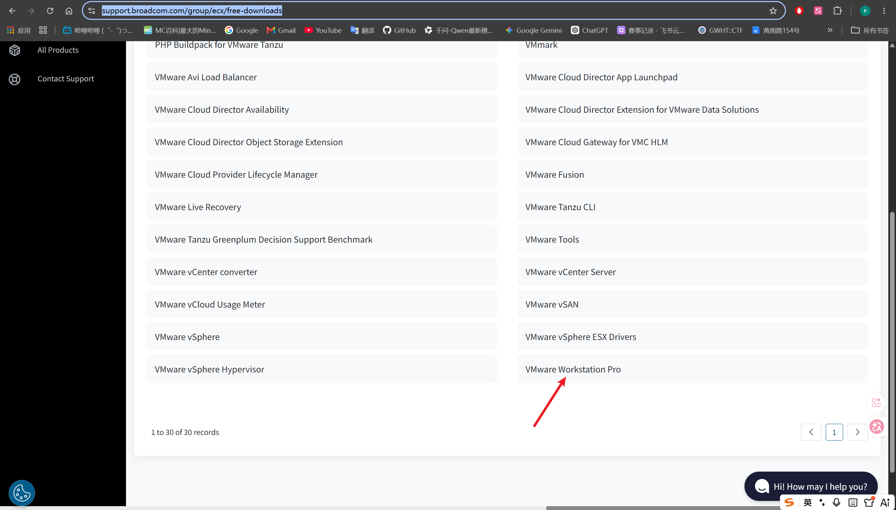
选择最新的17.6.4版本即可，更高的版本没有汉化，而且差别不大，因此不考虑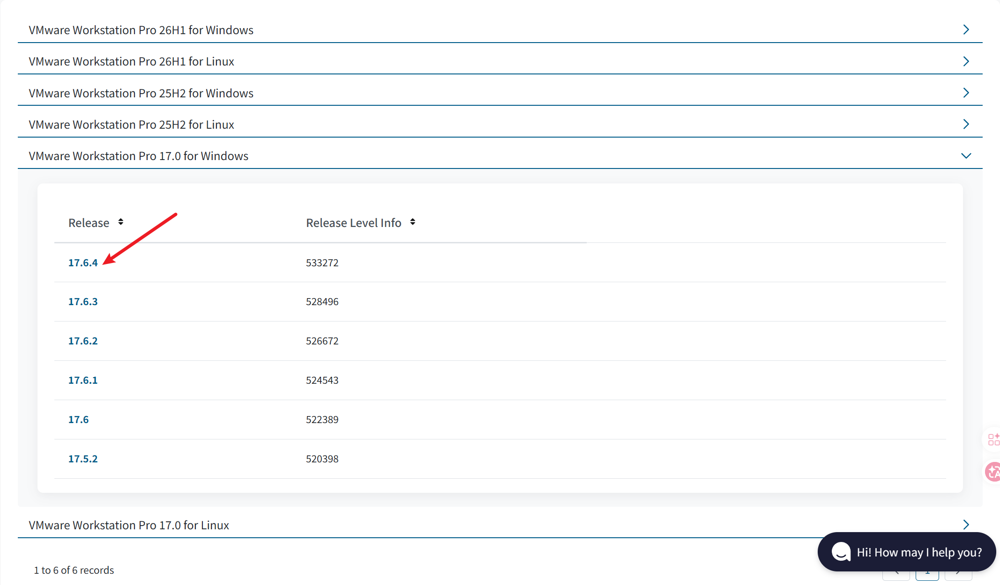
点击下载即可，这边可能会弹出一个补充信息的界面，如实填写即可，company那一栏可以填写Personal User
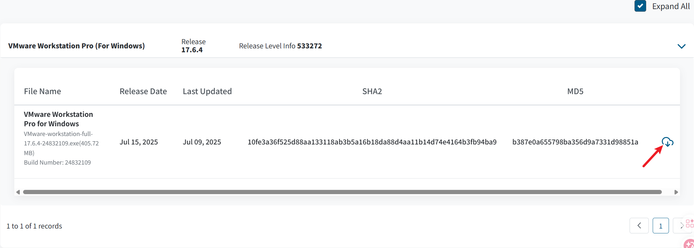
如果下载很慢可以尝试使用IDM下载器和`珂学上网`
或者去文末的网盘下吧（

## ubuntu镜像的获取
访问这个网站[https://www.releases.ubuntu.com/]
这里几乎所用的ubuntu大版本的镜像下载，我们下载最新的Ubuntu26.04LTS即可
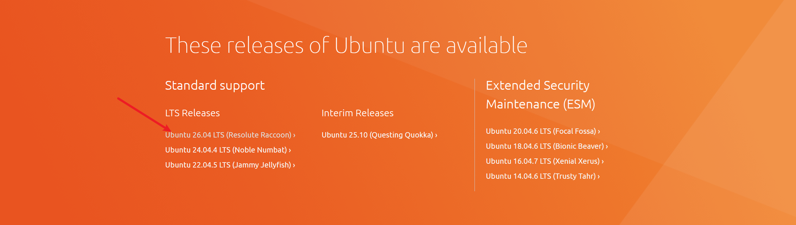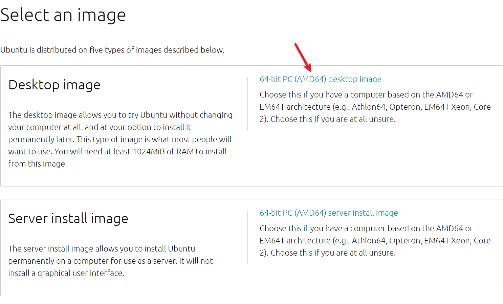
选择desktop image镜像，下载即可

## 安装ubuntu
首先先安装vmware，这个运行安装程序一路往下即可，不建议改安装路径，否则你得手动设置环境变量
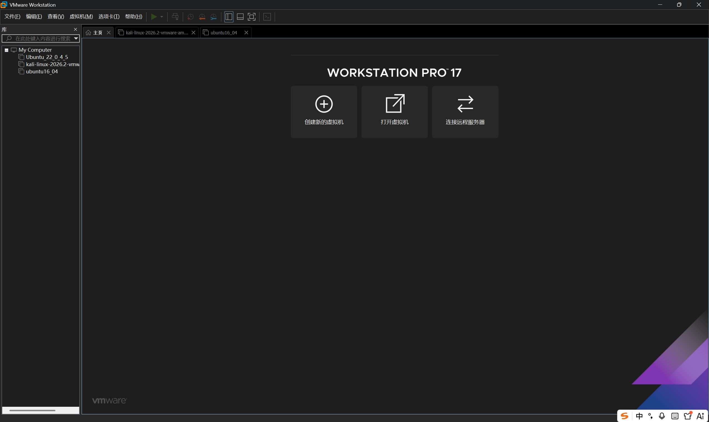
安装完成后我们选择创建新的虚拟机
选择自定义
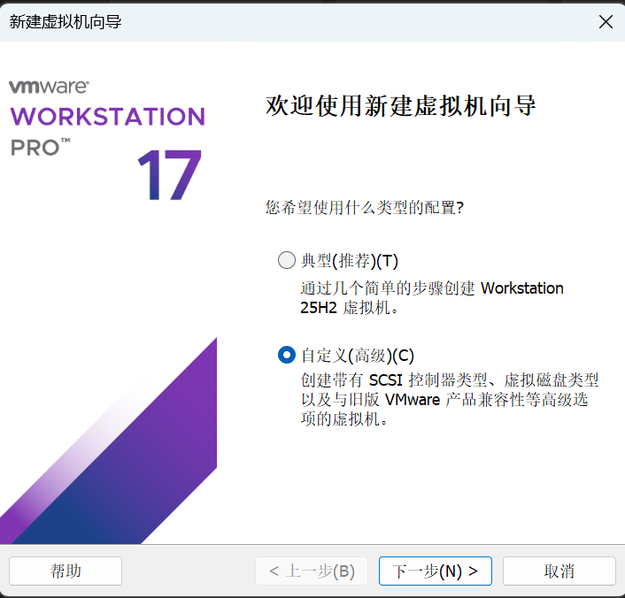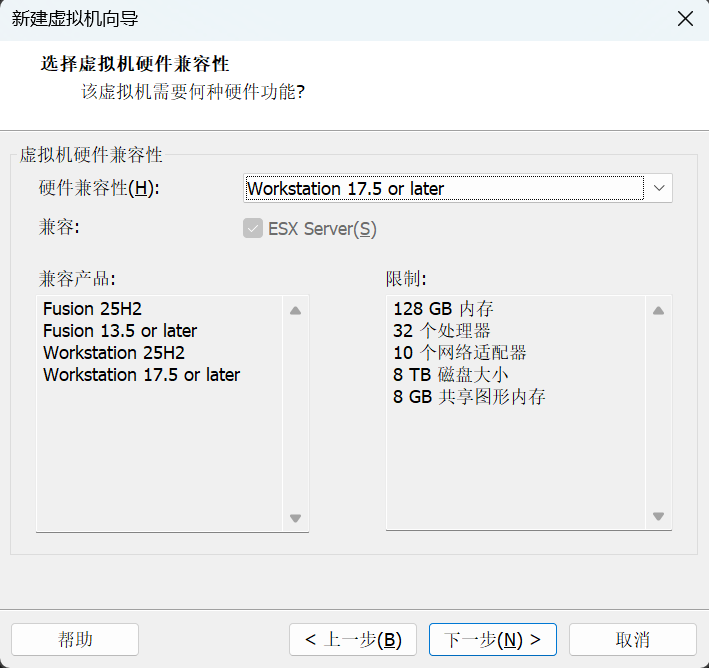
这里选择我们刚刚下好的镜像
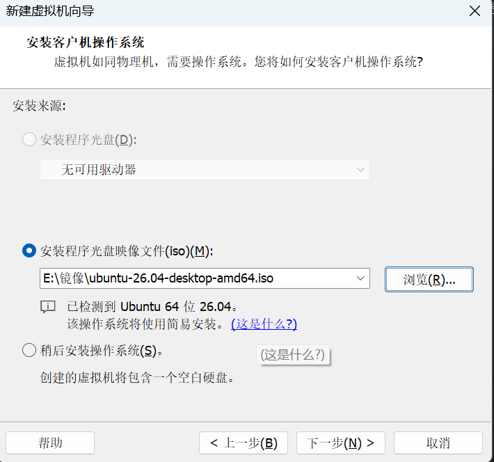
根据自己的喜好起用户名，这里随意
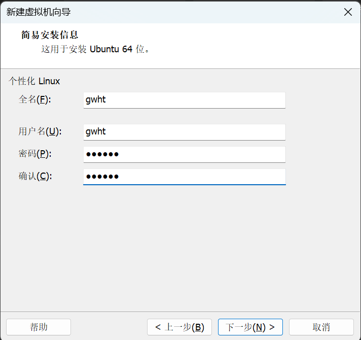
然后要注意，虚拟机名称随意，但储存位置建议修改至D盘或其他盘符，因为虚拟机的占用挺大的
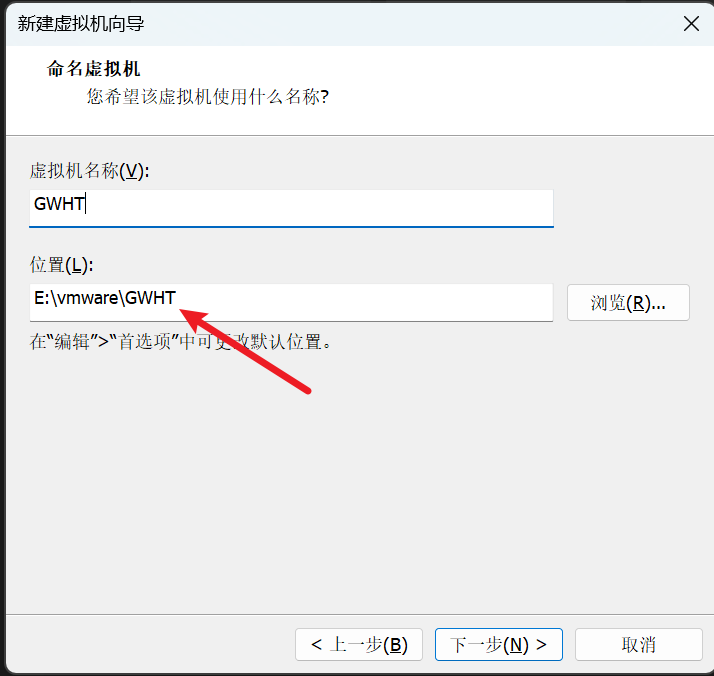
处理器数量选择1，内核数根据自己的电脑配置来分配，一般2-8都可以的，我这里选择4
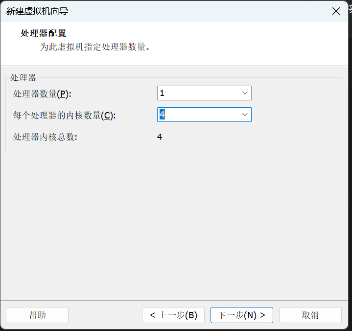
内存大小也看自己的电脑配置一般2-4就行
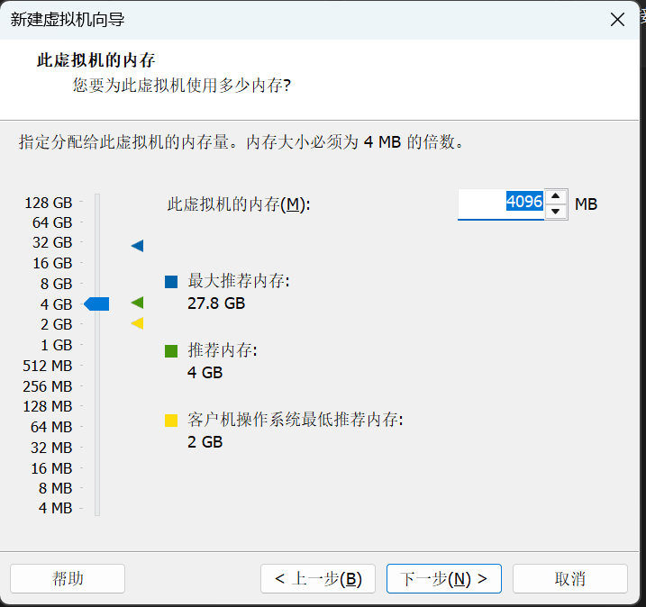
选择nat
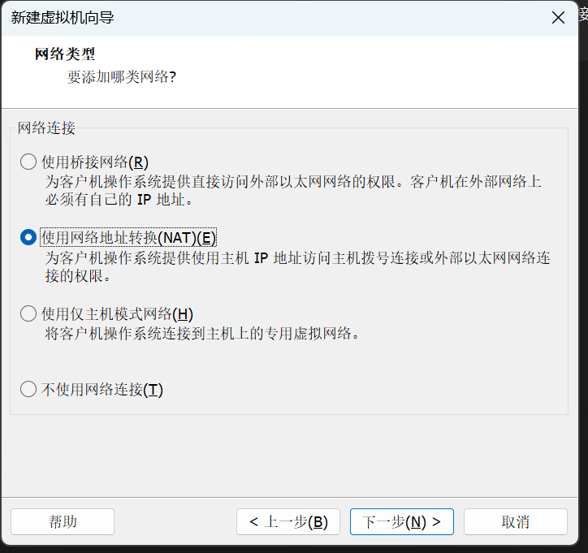
之后一路默认即可，直到指定磁盘容量，这里推荐将虚拟磁盘储存为单个文件，且分配40G
不用勾选立即分配所有磁盘空间
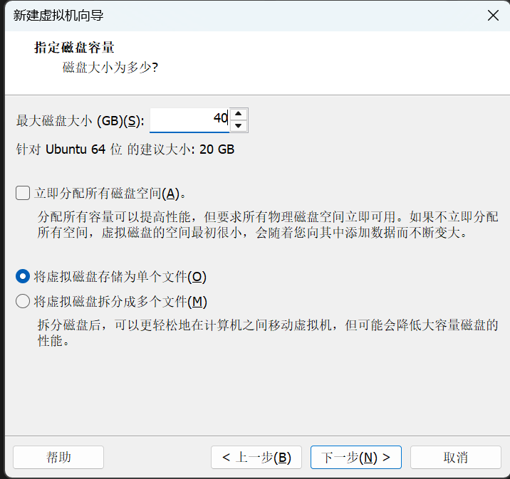
之后一路下一步直至完成即可，会自动开启虚拟机
等待一会后会弹出选择语言界面，这里划到最下面就有中文
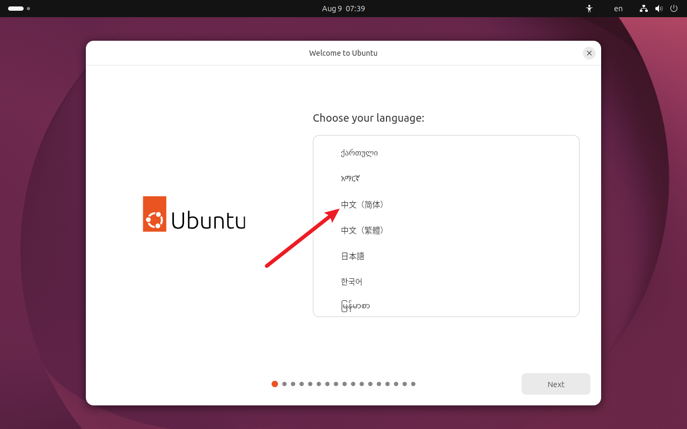
之后一路默认下一步即可，这里勾选为图形和Wi-FI硬件安装第三方软件可能会有用？
我没具体试过有什么区别，但是毕竟是驱动，勾选下总不是坏事
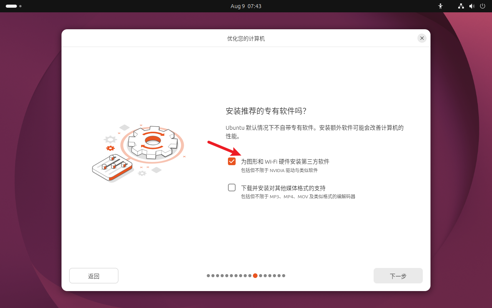
之后一路默认下一步，这里根据自己的喜好来
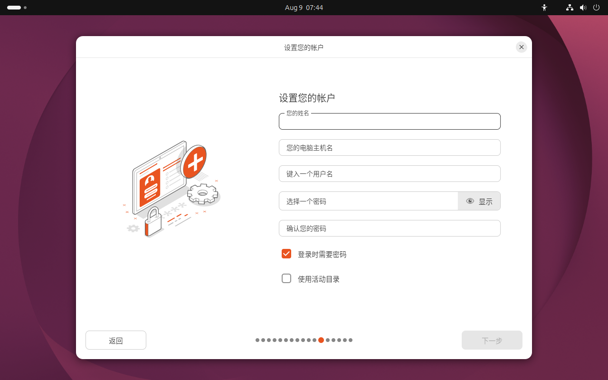
然后一路下一步安装即可，安装过程可能要等待一会，完成后点击重启即可
进入桌面
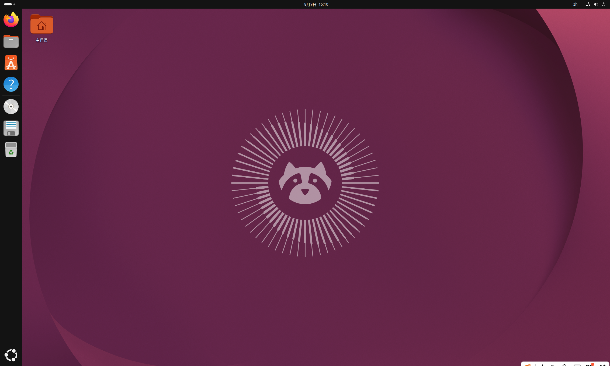
将以下文字保存为`install-tools.sh`，然后复制进虚拟机运行
```bash
#!/usr/bin/env bash

set -Eeuo pipefail

trap 'echo "[-] 第 ${LINENO} 行执行失败。"' ERR

TOOLS_DIR="${HOME}/tools"

ROPPER_DIR="${TOOLS_DIR}/ropper"
ROPPER_VENV="${ROPPER_DIR}/.venv"
ROPPER_BIN="${ROPPER_VENV}/bin/ropper"
ROPPER_LINK="/usr/local/bin/ropper"

PWNDBG_DIR="${TOOLS_DIR}/pwndbg"
PWNDB_DIR="${TOOLS_DIR}/Pwngdb"

GDBINIT="${HOME}/.gdbinit"

if [[ "${EUID}" -eq 0 ]]; then
    echo "[-] 请使用普通用户运行，不要执行 sudo $0"
    exit 1
fi

echo "[+] 获取 sudo 权限……"
sudo -v

echo "[+] 安装系统依赖……"
sudo apt update

sudo apt install -y \
    libxml2-dev \
    libxslt-dev \
    python3-pip \
    python3-venv \
    python3-full \
    python3-dev \
    python3-setuptools \
    libffi-dev \
    curl \
    clang \
    make \
    build-essential \
    libncursesw5-dev \
    libgdbm-dev \
    libc6-dev \
    libc6-dbg \
    tk-dev \
    openssl \
    git \
    gdb \
    gdbserver \
    ruby \
    ruby-dev \
    patchelf \
    python3-pwntools

echo "[+] 检查 uv……"

if ! command -v uv >/dev/null 2>&1; then
    curl -LsSf https://astral.sh/uv/install.sh | sh
fi

export PATH="${HOME}/.local/bin:${HOME}/.cargo/bin:${PATH}"

if ! command -v uv >/dev/null 2>&1; then
    echo "[-] uv 安装失败或不在 PATH 中。"
    exit 1
fi

UV_BIN="$(command -v uv)"

echo "[+] 创建 Ropper 虚拟环境……"

mkdir -p "${ROPPER_DIR}"

"${UV_BIN}" python install 3.12

"${UV_BIN}" venv \
    --clear \
    --python 3.12 \
    "${ROPPER_VENV}"

echo "[+] 安装 Ropper 及相关软件包……"

"${UV_BIN}" pip install \
    --python "${ROPPER_VENV}/bin/python" \
    capstone \
    filebytes \
    unicorn \
    keystone-engine \
    ropper

echo "[+] 创建 Ropper 全局命令……"

if [[ -e "${ROPPER_LINK}" && ! -L "${ROPPER_LINK}" ]]; then
    echo "[-] ${ROPPER_LINK} 已存在且不是符号链接。"
    exit 1
fi

sudo mkdir -p /usr/local/bin
sudo ln -sfn "${ROPPER_BIN}" "${ROPPER_LINK}"

echo "[+] 安装 Ruby 工具……"

sudo gem install --no-document one_gadget
sudo gem install --no-document seccomp-tools

mkdir -p "${TOOLS_DIR}"

clone_or_update() {
    local repository="$1"
    local directory="$2"

    if [[ -d "${directory}/.git" ]]; then
        echo "[+] 更新 $(basename "${directory}")……"
        git -C "${directory}" pull --ff-only
    elif [[ -e "${directory}" ]]; then
        echo "[-] ${directory} 已存在，但不是 Git 仓库。"
        exit 1
    else
        echo "[+] 克隆 $(basename "${directory}")……"
        git clone "${repository}" "${directory}"
    fi
}

clone_or_update \
    "https://github.com/pwndbg/pwndbg.git" \
    "${PWNDBG_DIR}"

clone_or_update \
    "https://github.com/scwuaptx/Pwngdb.git" \
    "${PWNDB_DIR}"

echo "[+] 安装 pwndbg……"

(
    cd "${PWNDBG_DIR}"
    bash ./setup.sh
)

echo "[+] 配置 ~/.gdbinit……"

if [[ -f "${GDBINIT}" ]]; then
    GDBINIT_BACKUP="${GDBINIT}.backup.$(date +%Y%m%d-%H%M%S)"
    cp -a "${GDBINIT}" "${GDBINIT_BACKUP}"
    echo "[+] 原配置已备份到 ${GDBINIT_BACKUP}"
fi

cp "${PWNDB_DIR}/.gdbinit" "${GDBINIT}"

sed -i \
    -e '1c\source ~/tools/pwndbg/gdbinit.py' \
    -e '2c\source ~/tools/Pwngdb/pwngdb.py' \
    -e '3c\source ~/tools/Pwngdb/angelheap/gdbinit.py' \
    "${GDBINIT}"

chmod 600 "${GDBINIT}"

echo "[+] 验证安装……"

"${ROPPER_LINK}" --help >/dev/null
command -v one_gadget >/dev/null
command -v seccomp-tools >/dev/null

echo
echo "[+] 安装完成。"
echo
echo "Ropper:"
echo "  ${ROPPER_LINK} -> ${ROPPER_BIN}"
echo
echo "项目目录:"
echo "  ${PWNDBG_DIR}"
echo "  ${PWNDB_DIR}"
echo
echo "GDB 配置:"
head -n 3 "${GDBINIT}"
echo
echo "可直接使用:"
echo "  gdb ./程序"
echo "  ropper --file ./程序"
echo "  one_gadget ./libc.so.6"
echo "  seccomp-tools dump ./程序"
```
运行完之后，安装就完成了
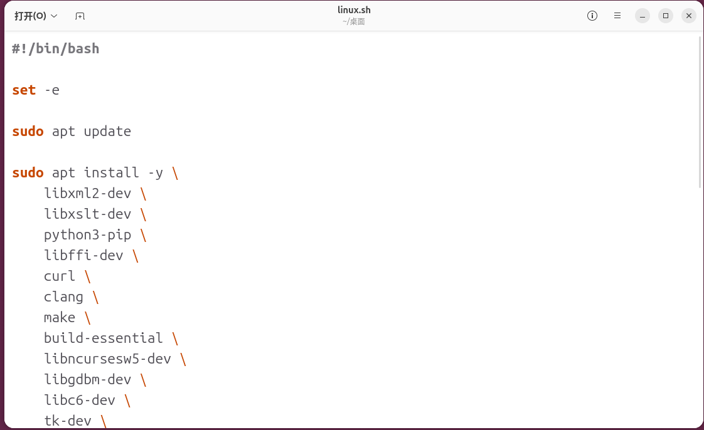
如图，然后右键桌面-终端中打开，先输入chmod 777 然后把文件拖进终端，会自动补充
或者直接输入`chmod 777 ./install-tools.sh` 
这一步完成后，再输入`./install-tools.sh`即可运行脚本
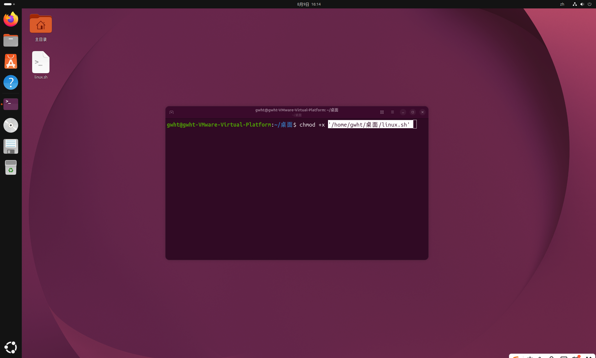
提示[sudo: authenticate] 密码： 则输入你刚刚设置的密码即可
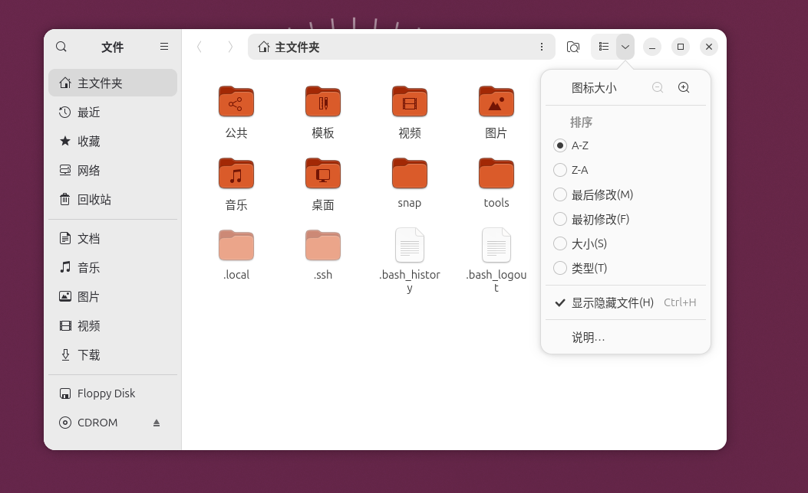

如果你需要设置让虚拟机也走代理，在设置-网络这里，开启网络代理，并设置为手动，
其中，URL写你本机的ipv4地址，然后在代理软件里打开允许来自局域网的连接，然后看下端口设置，一般默认为10808，则下图的设置端口处也填10808，http，https，socks5都要改。
或者是开启TUN模式，那么这里就不用设置。
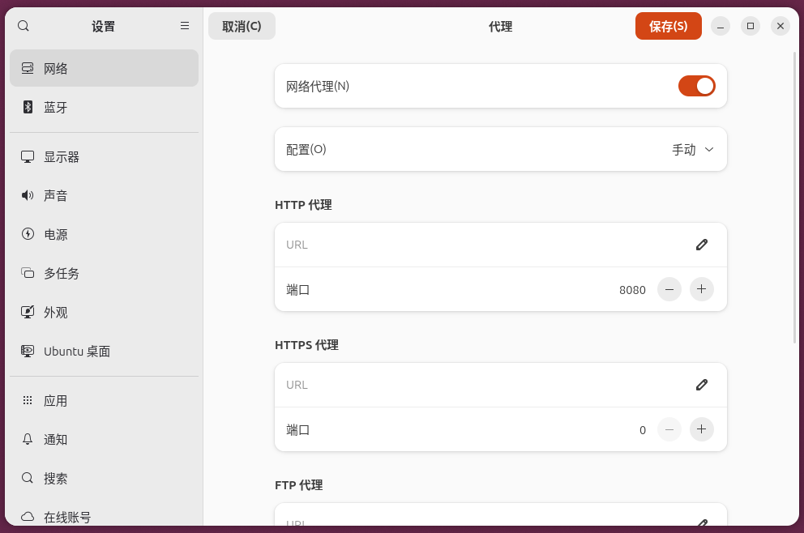
以上便是Vmware虚拟机的安装教程，对于初学者来说，使用图形化界面可能好上手一点
但如果是学习了一段时间后，对于命令行操作已经有了一定的基础的人，强烈推荐转到WSL

# 使用WSL安装
## 先开启WSL功能
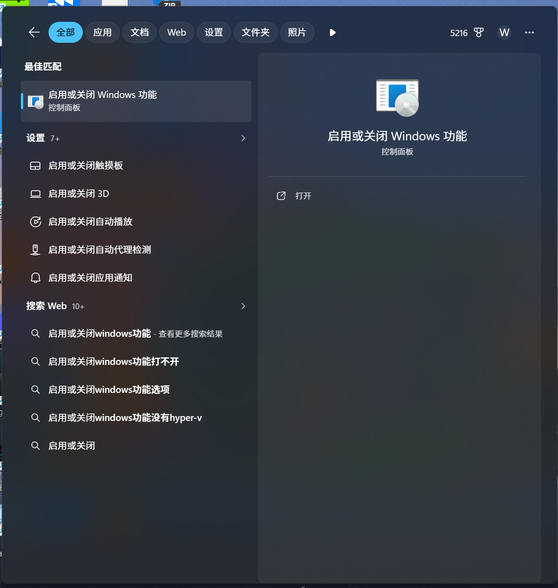
首先先在搜索栏搜索，`启用或关闭Windows功能`
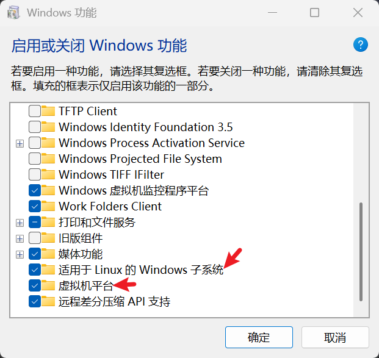
打开适用于`Linux的Windows子系统`和`虚拟机平台`
点击确定，然后**重启电脑。**
## 安装WSL-DashBoard
在这里推荐一个管理WSL的软件[WSL-DashBord](https://github.com/owu/wsl-dashboard)
提供了图形化的管理界面，可以供我们方便的去管理WSL
## 安装Ubuntu
安装完后，选择添加实例，安装源类型我们选择微软商店，选择Ubuntu26.04
实例安装目录可以修改下，默认是在C盘
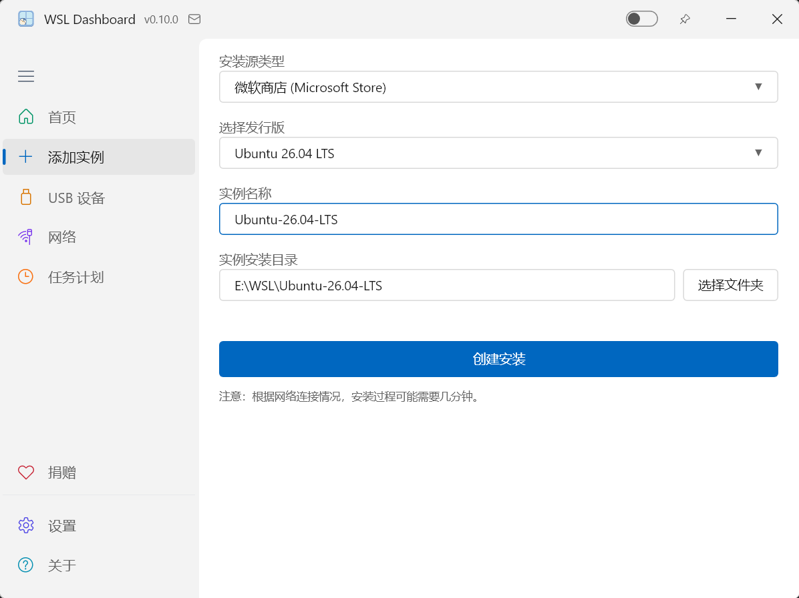
然后点击安装即可
提示创建成功后，过一会，我们的windows terminal就会有Ubuntu26.04的选项了
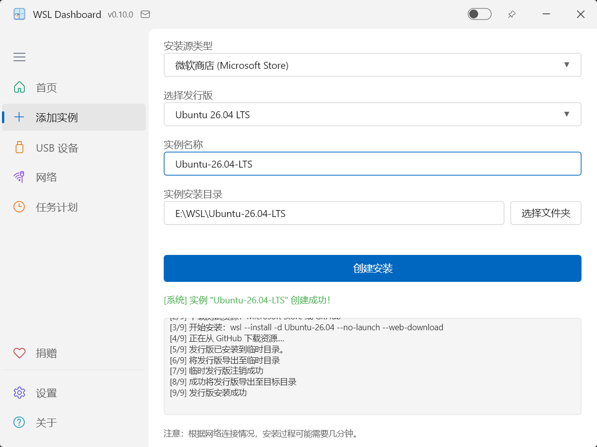
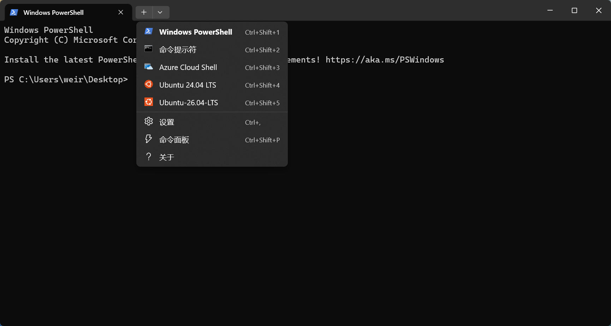
如果是第一次使用的话，可能会提示找不到Ubuntu Mono字体
我们可以到[Ubuntu Font](https://design.ubuntu.com/font)这个网站上，下载，然后安装`UbuntuMono-R`等4个字体即可
默认是root用户，我们来修改下，先执行：
```bash
sudo adduser (newname)
```
按提示设置密码和用户信息，设置完密码后的信息，可以直接按enter键跳过
然后把它加入 `sudo` 组：
```bash
sudo usermod -aG sudo (newname)
```
验证一下：
```bash
su - (newname)
sudo whoami
```
如果输出 `root`，说明 sudo 权限正常。
然后我们将其设置为默认用户
编辑配置文件：
```bash
sudo nano /etc/wsl.conf
```
写入：
```ini
[user]
default=newname
```
保存后，重启下该发行版，然后重新打开一个对话，默认会用`newname`登陆
### 设置代理
如果你想设置WSL的代理，可以在windows下，当前user目录中创建一个`.wslconfig`文件
然后写入
```ini
[wsl2]
networkingMode=mirrored
```
之后重启WSL即可，这是针对的所有WSL的发行版，且仅支持WSL2，会将网络设置为镜像模式，即和宿主机共用一个网络模式，会自动走系统代理
### 更换软件源
对于ubuntu26.04，其软件源的配置文件在`/etc/apt/sources.list.d/ubuntu.sources`
我们使用nano编辑这个文件
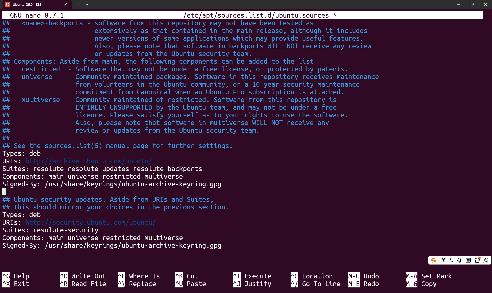
将最底下的两个URIs改为清华源`https://mirrors.tuna.tsinghua.edu.cn/ubuntu/`
或是阿里云`https://mirrors.aliyun.com/ubuntu/`
中科大源`https://mirrors.ustc.edu.cn/ubuntu/`
华为源`https://mirrors.huaweicloud.com/ubuntu/`
然后保存退出即可
### 设置软连接
WSL相比vmware虚拟机，有很大的优势在于性能以及可以直接访问windows下的文件，虽然vmware也能设置共享文件夹，但是设置起来有点麻烦。
我在windows下的D盘创建了`CTF`这个文件夹，用于存放有关CTF的附件及资料
那么，使用命令`ln -s /mnt/d/CTF ~/ctf`会将windows下的d盘的CTF文件夹，软连接到WSL下的~/ctf这个文件夹，这样那怕某一天ubuntu被你设置炸了，也不会导致你的数据读取不出来。
### 安装做pwn题的工具
运行`install-tools.sh`即可
### 安装Zsh(可选)
接下来是一些可选择的工具安装，并不是必须，但会让你的做题体验舒服一点
1.安装zsh
```bash
sudo apt install zsh
```
2.将 Zsh 设置为默认 Shell
先查看 Zsh 路径：
```bash
which zsh
```
通常是 `/usr/bin/zsh`，然后执行：
```bash
chsh -s "$(which zsh)"
```
通常重新开个会话就会切换到zsh了，不行的话重新启动下发行版
然后安装Oh My Zsh
```bash
sh -c "$(curl -fsSL https://raw.githubusercontent.com/ohmyzsh/ohmyzsh/master/tools/install.sh)"
```
我这边按照我喜欢的主题和插件安装，读者可以自己寻找喜欢的插件及主题
```bash
#自动建议插件
git clone https://github.com/zsh-users/zsh-autosuggestions.git \
  "$ZSH_CUSTOM/plugins/zsh-autosuggestions"
#语法高亮插件
git clone https://github.com/zsh-users/zsh-syntax-highlighting.git \
  "$ZSH_CUSTOM/plugins/zsh-syntax-highlighting"
#安装主题
git clone --depth=1 https://github.com/romkatv/powerlevel10k.git \
  "$ZSH_CUSTOM/themes/powerlevel10k"
```
然后配置zshrc
```bash
nano ~/.zshrc
```
找到主题配置，修改为
```zsh
ZSH_THEME="powerlevel10k/powerlevel10k"
```
找到 `plugins=(...)`，修改为：
```zsh
plugins=(
git
sudo
extract
zsh-autosuggestions
zsh-syntax-highlighting
)
```
然后加载配置
```zsh
source ~/.zshrc
```
如果没有出现主题设置，则可以手动输入
```zsh
p10k configure
```
会进入这个主题设置界面，我们先ctrl+c退出来，之后也是一样的方法进入，主要是我们先得设置下字体。
Powerlevel10k推荐使用MesloLGS NF，而WSL2中的文字实际由 Windows Terminal 渲染，因此字体要安装到Windows，而不只是安装在Ubuntu 里。
可以在这里下载[MesloLGSNF](https://github.com/fontmgr/MesloLGSNF)
然后在windows terminal，设置，选择我们的ubuntu，然后在外观这里选择字体，最后面保存即可
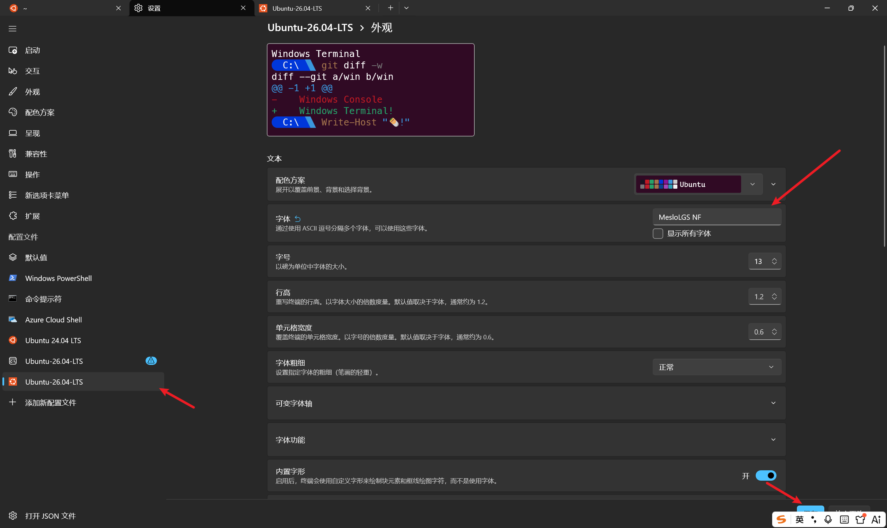
打开一个会话，就会进入主题设置环节
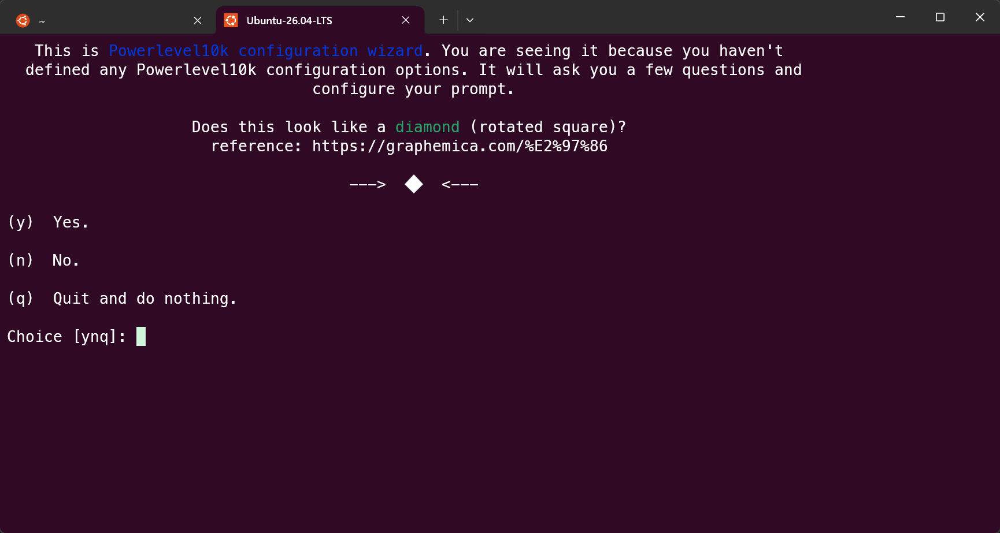
根据引导一步步设置即可
### 安装tmux(可选)
```bash
sudo apt install tmux
```
这个主要是我们后续分屏调试的时候方便
安装完之后，我们编辑tmux的配置文件
```bash
nano ~/.tmux.conf
```
写入
```text
# 开启鼠标支持 (点击切换窗格、调整大小、滚动)
set -g mouse on

# 提高历史滚动行数
set -g history-limit 5000
```


### 安装cpwn(可选)
在做题的时候经常需要指定程序运行时所用的libc，cpwn就是一个方便的工具
原项目地址[cpwn](https://github.com/GeekCmore/cpwn)，由于原项目已较长时间没维护，其安装脚本在Ubuntu26.04下已上无法正常使用。于是我fork了一份，并更新了安装脚本。本文使用的是我的非官方fork[cpwn](https://github.com/WeirSu/cpwn)
```bash
cd ~/tools
git clone https://github.com/WeirSu/cpwn
cd ./cpwn
chmod +x ./setup.sh
./setup.sh
```

安装完后，使用cpwn fetch拉取glibc，这个过程可能有点慢，需要耐心等待
如果提示网络错误，可能需要`珂学上网`
使用时，只需在elf程序所在目录输入cpwn init即可，cpwn会自动识别elf程序和libc，并生成exp.py和pwn_patched，exp.py的模版来自~/.config/cpwn/exp_template.py，可自行修改
我习惯添加一行`context.terminal = ["tmux", "splitw", "-l", "75%"]`
效果是，在tmux运行脚本时，如果使用gdb.attach，新开的GDB窗口会上下分屏，且在下方
方便调试


